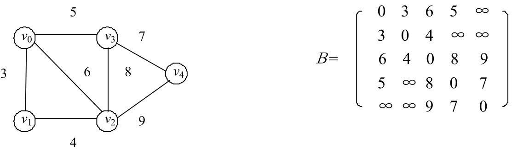

## 1. 图的数据结构

- 图分为 `有向图` 和 `无向图`

**图的一种数据结构**：

```go
package graph

type Edge struct {
	Weight int   // 权重(距离...)
	From   *Node // 从哪个 Node 出发
	To     *Node // 到哪个 Node 去
}

type Node struct {
	Value int     // 值
	In    int     // 入度，几条边进来
	Out   int     // 出度，几条边出去
	Nexts []*Node // 出去指向的节点列表
	Edges []*Edge // 哪些边属于自己(从自己出去)
}

type Graph struct {
	Nodes map[int]*Node // Node 编号 -> Node
	Edges map[*Edge]any // 边 Set
}
```

### 1.1 邻接表


### 1.2 邻接矩阵



## 2. 图的遍历

### 2.1 广度优先遍历

```go
package graph

func BFS(node *Node) []*Node {
	if node == nil {
		return nil
	}

	queue := make([]*Node, 0)
	set := make(map[*Node]any)
	rtn := make([]*Node, 0)

	queue = append(queue, node)
	set[node] = nil

	for len(queue) > 0 {
		curNode := queue[0]
		queue = queue[1:]
		rtn = append(rtn, curNode)

		for _, next := range curNode.Nexts {
			if _, ok := set[next]; !ok {
				queue = append(queue, next)
				set[next] = nil
			}
		}
	}

	return rtn
}
```

### 2.2 深度优先遍历

```go
package graph

func DFS(node *Node) []*Node {
	if node == nil {
		return nil
	}

	stack := make([]*Node, 0)
	set := make(map[*Node]any)
	rtn := make([]*Node, 0)

	stack = append(stack, node)
	set[node] = nil
	rtn = append(rtn, node)


	for len(stack) > 0 {
		curNode := stack[len(stack)-1]
		stack = stack[:len(stack)-1]

		for _, next := range curNode.Nexts {
			if _, ok := set[next]; !ok {
				stack = append(stack, curNode, next)
				set[next] = nil
				rtn = append(rtn, curNode)
				break
			}
		}
	}
	return rtn
}
```

## 3. 拓扑排序算法

> [维基百科](https://zh.wikipedia.org/wiki/%E6%8B%93%E6%92%B2%E6%8E%92%E5%BA%8F)
> 
> 在计算机科学领域，有向图的拓扑排序或拓扑测序是对其顶点的一种线性排序，使得对于从顶点 u 到顶点 v 的每个有向边 uv，u 在排序中都在 v 之前。
>
> 例如，图形的顶点可以表示要执行的任务，并且边可以表示一个任务必须在另一个任务之前执行的约束；在这个应用中，拓扑排序只是一个有效的任务顺序。
> 
> 再如，项目中各个包的依赖顺序(引入顺序、编译顺序)

**算法**：

- 入度为 0 的点为起点，加入返回值列表
- 去掉该点，重复上一步
- 直到所有点去掉

**实现**：

```go
package graph

func TopologySort(graph *Graph) []*Node {
	inMap := make(map[*Node]int)    // 记录 Node 剩余的入度
	zeroInQueue := make([]*Node, 0) // 入读为 0 的点才能进入队列
	rtn := make([]*Node, 0)

	// 找第一批入度为 0 的点
	for _, node := range graph.Nodes {
		inMap[node] = node.In
		if node.In == 0 {
			zeroInQueue = append(zeroInQueue, node)
		}
	}

	for len(zeroInQueue) > 0 {
		node := zeroInQueue[0]
		zeroInQueue = zeroInQueue[1:]
		rtn = append(rtn, node)

		// 擦除当前 node 对 next node 入度的影响
		for _, next := range node.Nexts {
			inMap[next]--
			if inMap[next] == 0 {
				zeroInQueue = append(zeroInQueue, next)
			}
		}
	}
	return rtn
}
```

