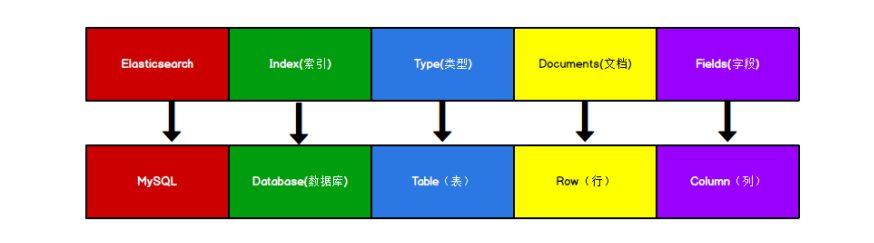

# Elasticsearch 入门


## 1. 数据格式

将 Elasticsearch 里存储文档数据和关系型数据库 MySQL 存储数据的概念进行一个类比:



> Types 的概念已经被逐渐弱化，Elasticsearch 6.X 中，一个 index 下已经只能包含一个 type，Elasticsearch 7.X 中, Type 的概念已经被删除了

## 2. HTTP 操作

### 2.1 索引操作

#### 2.1.1 创建索引

对比关系型数据库，创建索引就等同于创建数据库。

**PUT**请求创建索引：
```http
PUT http://127.0.0.1:9200/<索引名称>
```

响应：
```json
{
    "acknowledged": true,  // 创建成功
    "shards_acknowledged": true, // 分片成功
    "index": "shopping"  // 索引名称
}
```

> 由于幂等性，如果重复添加索引，会返回错误信息

#### 2.1.2 查看单个索引

```http
GET http://127.0.0.1:9200/<索引名称>
```

#### 2.1.3 查看所有索引

```http
GET 127.0.0.1:9200/_cat/indices?v
```
`_cat` 表示查看的意思，`indices` 表示索引

#### 2.1.4 删除索引

```http
DELETE http://127.0.0.1:9200/<索引名称>
```

### 2.2 文档操作

#### 2.2.1 创建文档

```http
POST http://127.0.0.1:9200/<索引名称>/_doc
```

> 此处发送请求的方式必须为 POST，不能是 PUT，否则会发生错误。由于 PUT 是幂等的，每次提交返回因果应该一致，但创建返回的 id 每次不一样

自定义 id：
```http
POST | PUT http://127.0.0.1:9200/<索引名称>/_doc/<自定义id>
```

> 此处可以用 PUT，因为固定 id 了，满足了幂等性

#### 2.2.2 查看文档

主键查询：

```http
GET http://127.0.0.1:9200/<索引名称>/_doc/<id>
```

全查询：

```http
GET http://127.0.0.1:9200/<索引名称>/_search
```

条件查询：

```http
GET http://127.0.0.1:9200/<索引名称>/_search?q=<查询条件>
```

或在 body 中添加：

```json
{
    "query": {
        "match": {
            "category": "小米"
        }
    }
}
```

分页 body：

```json
{
  "from": 0,
  "size": 2
}
```

指定查询字段 body：

```json
{
    "_source": ["title"]
}
```

排序 body:

```json
{
    "sort": {
        "price": {
            "order": "desc"
        }
    }
}
```

#### 2.2.3 修改文档

覆盖性修改：

```http
POST | PUT http://127.0.0.1:9200/<索引名称>/_doc/<id>
```

修改字段：

```http
POST http://127.0.0.1:9200/<索引名称>/_update/<id>
```

body for _update:
```json
{
  "doc": {
    "<field>": "<value>"
  }
}
```

#### 2.2.4 删除文档

```http
DELETE http://127.0.0.1:9200/<索引名称>/_doc/<id>
```

### 2.3 映射操作

创建数据库表需要设置字段名称，类型，长度，约束等；索引库也一样，需要知道这个类型下有哪些字段，每个字段有哪些约束信息，这就叫做映射(mapping)。


#### 2.3.1 创建映射

```http
POST http://127.0.0.1:9200/<索引名称>/_mapping
```

#### 2.3.2 查看映射

```http
GET http://127.0.0.1:9200/<索引名称>/_mapping
```

## 3. Python API 操作

```python
import functools
import json

import elasticsearch
import elasticsearch.helpers
import elasticsearch_dsl
from elasticsearch_dsl import Q
from pydantic import BaseModel


class UserModel(BaseModel):
    name: str
    age: int
    sex: str


def print_returned_value(func):
    @functools.wraps(func)
    def wrapper(*args, **kwargs):
        rtn = func(*args, **kwargs)
        print(rtn)
        return rtn

    return wrapper


def print_elasticsearch_exception(func):
    @functools.wraps(func)
    def wrapper(*args, **kwargs):
        try:
            rtn = func(*args, **kwargs)
        except elasticsearch.ElasticsearchException as e:
            print(str(e))
        else:
            return rtn

    return wrapper


class ElasticSearchTest:
    def __init__(self):
        self.client = elasticsearch.Elasticsearch('http://localhost:9200')

    @print_returned_value
    @print_elasticsearch_exception
    def create_index(self):
        """ 创建索引 """
        resp = self.client.indices.create('user')
        return resp

    @print_returned_value
    @print_elasticsearch_exception
    def get_index(self):
        """ 查询索引 """
        resp = self.client.indices.get('user')
        return resp

    @print_returned_value
    @print_elasticsearch_exception
    def delete_index(self):
        """ 删除索引 """
        resp = self.client.indices.delete('user')
        return resp

    @print_returned_value
    @print_elasticsearch_exception
    def create_doc(self):
        """ 插入数据 """
        user = UserModel(
            name='zhangsan',
            age=30,
            sex='男',
        )
        resp = self.client.create(index='user', id=1001, body=user.json())
        return resp

    @print_returned_value
    @print_elasticsearch_exception
    def update_doc(self):
        """ 更新数据 """
        body = {
            'doc': {
                'sex': '女'
            }
        }
        resp = self.client.update(index='user', id=1001, body=json.dumps(body))
        return resp

    @print_returned_value
    @print_elasticsearch_exception
    def get_doc(self):
        """ 查询数据 """
        resp = self.client.get(index='user', id=1001)
        return resp

    @print_returned_value
    @print_elasticsearch_exception
    def delete_doc(self):
        """ 删除数据 """
        resp = self.client.delete(index='user', id=1001)
        return resp

    @print_returned_value
    @print_elasticsearch_exception
    def bulk_create_doc(self):
        """ 批量创建数据 """
        users = [
            UserModel(name='zhangsan', age=30, sex='男').dict(),
            UserModel(name='lisi', age=30, sex='女').dict(),
            UserModel(name='wangwu', age=40, sex='男').dict(),
            UserModel(name='wangwu1', age=40, sex='女').dict(),
            UserModel(name='wangwu2', age=50, sex='男').dict(),
            UserModel(name='wangwu3', age=50, sex='男').dict(),

        ]
        actions = []
        for i in range(len(users)):
            actions.append(
                {'_op_type': 'create',
                 '_index': 'user',
                 '_id': 1001 + i,
                 '_source': users[i]}
            )
        resp = elasticsearch.helpers.bulk(self.client, actions)
        return resp

    @print_returned_value
    @print_elasticsearch_exception
    def bulk_delete_doc(self):
        """ 批量删除数据 """
        actions = []
        for i in range(6):
            actions.append(
                {'_op_type': 'delete',
                 '_index': 'user',
                 '_id': 1001 + i}
            )
        resp = elasticsearch.helpers.bulk(self.client, actions)
        return resp

    @print_returned_value
    @print_elasticsearch_exception
    def search_all_doc(self):
        """ 查询所有 """
        s = elasticsearch_dsl.Search(using=self.client, index='user')
        resp = s.execute()
        return resp.hits

    @print_returned_value
    @print_elasticsearch_exception
    def search_filtered_doc(self):
        """ 条件查询 """
        s = elasticsearch_dsl.Search(using=self.client, index='user').filter('term', age=30)
        resp = s.execute()
        return resp.hits

    @print_returned_value
    @print_elasticsearch_exception
    def search_paginated_doc(self):
        """ 分页查询 elasticsearch_dsl 依赖 slicing 分页 """
        s = elasticsearch_dsl.Search(using=self.client, index='user')[2:4]
        resp = s.execute()
        return resp.hits

    @print_returned_value
    @print_elasticsearch_exception
    def search_ordered_doc(self):
        """ 排序查询 `-` 代表 DESC """
        s = elasticsearch_dsl.Search(using=self.client, index='user').sort('-age')
        resp = s.execute()
        return resp.hits

    @print_returned_value
    @print_elasticsearch_exception
    def search_field_doc(self):
        """ 指定或排除字段查询 """
        includes = []
        excludes = ['age']
        s = elasticsearch_dsl.Search(using=self.client, index='user') \
            .source(includes=includes, excludes=excludes)
        resp = s.execute()
        return resp.hits

    @print_elasticsearch_exception
    def search_multi_filter_doc(self):
        """ 组合条件 Q 组合(| & ~)会自动生成 bool : should must must_not"""
        s = elasticsearch_dsl.Search(using=self.client, index='user') \
            .query(Q('match', age=30) & ~Q('match', sex='男'))  # ~ 表示 not
        resp = s.execute()
        print(resp.hits)

        s = elasticsearch_dsl.Search(using=self.client, index='user') \
            .query(Q('match', age=30) | Q('match', age=40))
        resp = s.execute()
        print(resp.hits)

    @print_elasticsearch_exception
    def search_range_doc(self):
        """ 范围查询 """
        s = elasticsearch_dsl.Search(using=self.client, index='user') \
            .filter('range', age={'gte': 30, 'lt': 50})
        resp = s.execute()
        print(resp.hits)

    @print_elasticsearch_exception
    def search_fuzzy_queried_doc(self):
        """ 模糊查询 """
        s = elasticsearch_dsl.Search(using=self.client, index='user') \
            .query(Q({'fuzzy': {"name": {"value": "wangwu", "fuzziness": 1}}}))
        resp = s.execute()
        print(resp.hits)

    @print_elasticsearch_exception
    def search_highlight_doc(self):
        """ 高亮查询 """
        s = elasticsearch_dsl.Search(using=self.client, index='user') \
            .query('match', name='zhangsan') \
            .highlight('name', pre_tags='<font color="red">', post_tags='</font>')
        resp = s.execute()
        print(resp.hits)
        print(resp.hits[0].meta.highlight)

    @print_elasticsearch_exception
    def search_agg_doc(self):
        """ 聚合查询 """
        s = elasticsearch_dsl.Search(using=self.client, index='user')
        s.aggs.metric('max_age', 'max', field='age')
        resp = s.execute()
        print(resp.aggs)

        # 分组
        s = elasticsearch_dsl.Search(using=self.client, index='user')
        s.aggs.bucket('age_group', 'terms', field='age')
        resp = s.execute()
        print(resp.aggs.age_group.buckets)
```


---

> 作者: [黄波](https://dilless.github.io)  
> URL: https://dilless.github.io/posts/notes/databases/elasticsearch/atguigu_elasticsearch_lesson/elasticsearch-basic-usage/  

