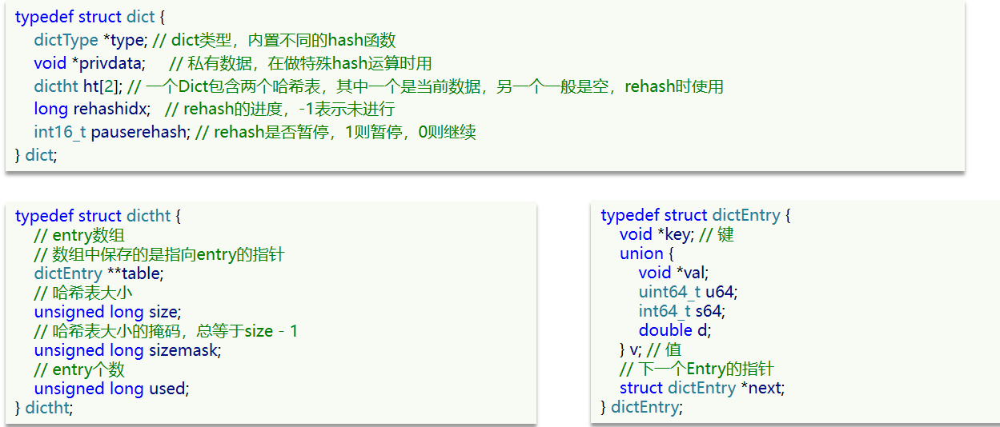
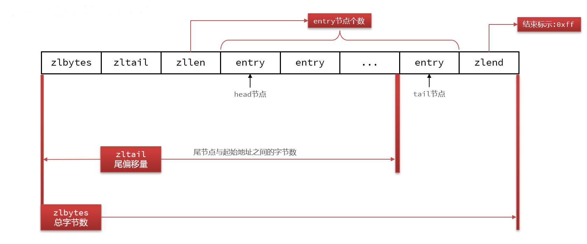
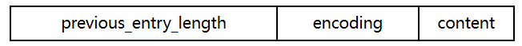

# 高级篇（三）Redis 原理篇（一）数据结构

## 1. 基本数据结构

### 1.1 动态字符串 SDS

Redis 没有直接使用 C 语言中的字符串，因为 C 语言字符串存在很多问题：
- 获取字符串长度的需要通过运算
- 非二进制安全
- 不可修改

Redis构建了一种新的字符串结构，称为简单动态字符串（Simple Dynamic String），简称SDS。

SDS 具备动态扩容能力，如果我们要给SDS追加一段字符串，首先会申请新内存空间，称为**内存预分配**，再把值写入：
- 如果新字符串小于 1M，则新空间为扩展后字符串长度的两倍 + 1
- 如果新字符串大于 1M，则新空间为扩展后字符串长度 + 1M + 1

SDS 优点：
- 获取字符串长度时间复杂度为 O(1)
- 支持动态扩容
- 减少内存分配次数
- 二进制安全

### 1.2 intset

IntSet 是 Redis 中 set 集合的一种实现方式，基于整数数组来实现，并且具备长度可变、有序等特征。
结构如下：

其中的 encoding 包含三种模式，表示存储的整数大小不同：

**`contents[]` 存指向实际数组其实位置的指针，数据编码由 encoding 决定**

为了方便查找，Redis 会将 intset 中所有的整数按照升序依次保存在contents数组中

我们向`encoding: INTSET_ENC_INT16`的 IntSet 添加一个数字：50000，这个数字超出了int16_t的范围，intset会自动升级编码方式到合适的大小，流程如下：
- 升级编码为INTSET_ENC_INT32, 每个整数占4字节，并按照新的编码方式及元素个数扩容数组
- 倒序依次将数组中的元素拷贝到扩容后的正确位置（后面的先往后放，如果正序，前面的扩容，后面就被覆盖了）
- 将待添加的元素放入数组末尾或开头（新的更大bit的元素只能大于或小于现有所有元素）
- 最后，将inset的encoding属性改为INTSET_ENC_INT32，将length属性改为4

总结：
- IntSet 中的元素唯一、有序
- 升级机制，节省内存空间
- 底层采用二分查找来查询，数据量不大的时候效率还行

### 1.3 Dict

Redis 键与值的映射关系正是通过 Dict 来实现的。 Dict由三部分组成，分别是：哈希表（DictHashTable）、哈希节点（DictEntry）、字典（Dict）

当我们向 Dict 添加键值对时，Redis首先根据key计算出hash值（h），然后利用 `h & sizemask`（相当于 `h % size`）来计算元素应该存储到数组中的哪个索引位置。

Dict 在每次新增键值对时都会检查负载因子（LoadFactor = used/size） ，满足以下两种情况时会触发哈希表扩容：
- 哈希表的 LoadFactor >= 1，并且服务器没有执行 BGSAVE 或者 BGREWRITEAOF 等后台进程
- 哈希表的 LoadFactor > 5 

Dict 每次删除元素时，当 LoadFactor 小于 0.1 时，Dict 收缩。

**Dict的rehash**

不管是扩容还是收缩，必定会创建新的哈希表，导致哈希表的 size 和 sizemask 变化，而key的查询与 sizemask 有关。因此必须对哈希表中的每一个 key 重新计算索引，插入新的哈希表，这个过程称为 rehash。过程是这样的：

1. 计算新 hash 表的 realSize，值取决于当前要做的是扩容还是收缩：
  - 如果是扩容，则新 size 为第一个大于等于 dict.ht[0].used + 1 的 2^n
  - 如果是收缩，则新 size 为第一个大于等于 dict.ht[0].used 的 2^n（不得小于4）

2. 按照新的 realSize 申请内存空间，创建 dictht，并赋值给 dict.ht[1]
3. 设置 dict.rehashidx = 0，标示开始 rehash
4. ~~将 dict.ht[0]中的每一个 dictEntry 都 rehash 到 dict.ht[1]~~
5. 在 rehash 过程中，新增操作，则直接写入 ht[1]，查询、修改和删除则会在 dict.ht[0] 和 dict.ht[1] 依次查找并执行。这样可以确保 ht[0] 的数据只减不增，随着rehash最终为空
6. 将 dict.ht[1]赋值给 dict.ht[0]，给 dict.ht[1] 初始化为空哈希表，释放原来的 dict.ht[0] 的内存 
7. 将 rehashidx 赋值为 -1，代表rehash结束

**总结**：

Dict的结构：

- 类似java的HashTable，底层是数组加链表来解决哈希冲突
- Dict包含两个哈希表，ht[0]平常用，ht[1]用来rehash

Dict的伸缩：

- 当LoadFactor大于5或者LoadFactor大于1并且没有子进程任务时，Dict扩容
- 当LoadFactor小于0.1时，Dict收缩
- 扩容大小为第一个大于等于used + 1的2^n
- 收缩大小为第一个大于等于used 的2^n
- Dict采用渐进式rehash，每次访问Dict时执行一次rehash
- rehash时ht[0]只减不增，新增操作只在ht[1]执行，其它操作在两个哈希表

###  1.4 ZipList

**整体结构**

ZipList 是一种特殊的“双端链表” ，由一系列特殊编码的连续内存块组成。可以在任意一端进行压入/弹出操作, 并且该操作的时间复杂度为 O(1)。

| **属性** | **类型** | **长度** | **用途**                                                     |
| -------- | -------- | -------- | ------------------------------------------------------------ |
| zlbytes  | uint32_t | 4 字节   | 记录整个压缩列表占用的内存字节数                             |
| zltail   | uint32_t | 4 字节   | 记录压缩列表表尾节点距离压缩列表的起始地址有多少字节，通过这个偏移量，可以确定表尾节点的地址。 |
| zllen    | uint16_t | 2 字节   | 记录了压缩列表包含的节点数量。 最大值为UINT16_MAX （65534），如果超过这个值，此处会记录为65535，但节点的真实数量需要遍历整个压缩列表才能计算得出。 |
| entry    | 列表节点 | 不定     | 压缩列表包含的各个节点，节点的长度由节点保存的内容决定。     |
| zlend    | uint8_t  | 1 字节   | 特殊值 0xFF （十进制 255 ），用于标记压缩列表的末端。        |

**ZipListEntry**

- previous_entry_length：前一节点的长度，占1个或5个字节。
  - 如果前一节点的长度小于254字节，则采用1个字节来保存这个长度值
  - 如果前一节点的长度大于254字节，则采用5个字节来保存这个长度值，第一个字节为0xfe，后四个字节才是真实长度数据

- encoding：编码属性，记录content的数据类型（字符串还是整数）以及长度，占用1个、2个或5个字节
- contents：负责保存节点的数据，可以是字符串或整数

ZipList中所有存储长度的数值均采用**小端字节序**，即低位字节在前，高位字节在后。例如：数值0x1234，采用小端字节序后实际存储值为：0x3412

**Encoding**

ZipListEntry中的encoding编码分为字符串和整数两种：
- 字符串：如果encoding是以“00”、“01”或者“10”开头，则证明content是字符串

| **编码**                                             | **编码长度** | **字符串大小**      |
| ---------------------------------------------------- | ------------ | ------------------- |
| \|00pppppp\|                                         | 1 bytes      | <= 63 bytes         |
| \|01pppppp\|qqqqqqqq\|                               | 2 bytes      | <= 16383 bytes      |
| \|10000000\|qqqqqqqq\|rrrrrrrr\|ssssssss\|tttttttt\| | 5 bytes      | <= 4294967295 bytes |

- 整数：如果encoding是以“11”开始，则证明content是整数，且encodin g固定只占用1个字节

| **编码** | **编码长度** | **整数类型**                                                                                    |
| -------- | ------------ |---------------------------------------------------------------------------------------------|
| 11000000 | 1            | int16_t（2 bytes）                                                                            |
| 11010000 | 1            | int32_t（4 bytes）                                                                            |
| 11100000 | 1            | int64_t（8 bytes）                                                                            |
| 11110000 | 1            | 24位有符整数(3 bytes)                                                                            |
| 11111110 | 1            | 8位有符整数(1 bytes)                                                                             |
| 1111xxxx | 1            | 直接在xxxx位置保存数值，范围从0001~1101(1 - 13)(因为0000、1110在上面占用了，0xff 是 ziplist 结束标识)，减1后结果为实际值(0 - 12) |

**ZipList的连锁更新问题**

假设我们有N个连续的、长度为250~253字节之间的entry，左边新增、删除都可能导致连锁更新的发生。

**总结：**

- 压缩列表的可以看做一种连续内存空间的"双向链表"
- 列表的节点之间不是通过指针连接，而是记录上一节点和本节点长度来寻址，内存占用较低
- 如果列表数据过多，导致链表过长，可能影响查询性能
- 增或删较大数据时有可能发生连续更新问题

### 1.5 QuickList

它是一个双端链表，只不过链表中的每个节点都是一个 ZipList。

为了避免QuickList中的每个ZipList中entry过多，Redis提供了一个配置项：`list-max-ziplist-size`来限制。

由于读首尾比较多，QuickList 还可以对中间节点的 ZipList 进行压缩，通过 `list-compress-depth` 配置。

**总结**

QuickList的特点：

- 是一个节点为ZipList的双端链表
- 节点采用ZipList，解决了传统链表的内存占用问题
- 控制了ZipList大小，解决连续内存空间申请效率问题
- 中间节点可以压缩，进一步节省了内存

### 1.6 SkipList

SkipList（跳表）本质是链表，但与传统链表相比有几点差异：
- 元素按照升序排列存储
- 节点可能包含多个指针，指针跨度不同。

**总结**

SkipList的特点：

- 跳跃表是一个双向链表，每个节点都包含score和ele值
- 节点按照score值排序，score值一样则按照ele字典排序
- 每个节点都可以包含多层指针，层数是1到32之间的随机数
- 不同层指针到下一个节点的跨度不同，层级越高，跨度越大
- 增删改查效率与红黑树基本一致，实现却更简单

### 1.7 RedisObject

Redis中的任意数据类型的键和值都会被封装为一个RedisObject。

> String 类型每个对象都有一个头，占用内存，尽量用集合类型代替

**11种编码**

| **编号** | **编码方式**            | **说明**               |
| -------- | ----------------------- | ---------------------- |
| 0        | OBJ_ENCODING_RAW        | raw编码动态字符串      |
| 1        | OBJ_ENCODING_INT        | long类型的整数的字符串 |
| 2        | OBJ_ENCODING_HT         | hash表（字典dict）     |
| 3        | OBJ_ENCODING_ZIPMAP     | 已废弃                 |
| 4        | OBJ_ENCODING_LINKEDLIST | 双端链表               |
| 5        | OBJ_ENCODING_ZIPLIST    | 压缩列表               |
| 6        | OBJ_ENCODING_INTSET     | 整数集合               |
| 7        | OBJ_ENCODING_SKIPLIST   | 跳表                   |
| 8        | OBJ_ENCODING_EMBSTR     | embstr的动态字符串     |
| 9        | OBJ_ENCODING_QUICKLIST  | 快速列表               |
| 10       | OBJ_ENCODING_STREAM     | Stream流               |

**5种数据类型**

| **数据类型** | **编码方式**                                       |
| ------------ | -------------------------------------------------- |
| OBJ_STRING   | int、embstr、raw                                   |
| OBJ_LIST     | LinkedList和ZipList(3.2以前)、QuickList（3.2以后） |
| OBJ_SET      | intset、HT                                         |
| OBJ_ZSET     | ZipList、HT、SkipList                              |
| OBJ_HASH     | ZipList、HT                                        |

> BitMap, HyperLogLog 底层就是 String

## 2. 五种数据类型

### 2.1 String

- 其基本编码方式是RAW，基于简单动态字符串（SDS）实现，存储上限为512mb。
- 如果存储的SDS长度小于44字节（实际内容长度，不包括 SDS head），则会采用 EMBSTR 编码，此时 **object head** 与 **SDS** 是一段连续空间（Redis Object 和 SDS 加一起不超过 64 字节）。申请内存时只需要调用一次内存分配函数，效率更高。
- 如果存储的字符串是整数值，并且大小在 LONG_MAX 范围内，则会采用 INT 编码：直接将数据保存在 RedisObject 的 ptr 指针位置（刚好 8 字节），不再需要 SDS 了。

> 使用 String 时尽量小于 44 字节，能用整数值尽量用整数；key 也是 String 类型，因此尽量不超过 44 字节。

### 2.2 List

在 3.2 版本之后，Redis 统一采用 QuickList 来实现 List

### 2.3 Set

- 为了查询效率和唯一性，set采用HT编码（Dict）。Dict中的key用来存储元素，value统一为null。
- 当存储的所有数据都是整数，并且元素数量不超过set-max-intset-entries时，Set 会采用 IntSet 编码，以节省内存
- 插入时，如果不满足 IntSet 条件，会进行编码转换

### 2.4 ZSet(SortedSet)

通过 Dict 和 SkipList 实现：

当元素数量不多时，HT和SkipList的优势不明显，而且更耗内存。因此zset还会采用ZipList结构来节省内存，不过需要同时满足两个条件：

- 元素数量小于zset_max_ziplist_entries，默认值128
- 每个元素都小于zset_max_ziplist_value字节，默认值64

ziplist本身没有排序功能，而且没有键值对的概念，因此需要有zset通过编码实现：

- ZipList是连续内存，因此score和element是紧挨在一起的两个entry， element在前，score在后 
- score越小越接近队首，score越大越接近队尾，按照score值升序排列

添加元素时可能触发编码转换

### 2.5 Hash

Hash结构默认采用ZipList编码，用以节省内存。 ZipList中相邻的两个entry 分别保存field和value 

当数据量较大时，Hash结构会转为HT编码，也就是Dict，触发条件有两个：

- ZipList中的元素数量超过了hash-max-ziplist-entries（默认512）
- ZipList中的任意entry大小超过了hash-max-ziplist-value（默认64字节）

Redis的hash之所以这样设计，是因为当ziplist变得很⼤的时候，它有如下几个缺点：

- 每次插⼊或修改引发的realloc操作会有更⼤的概率造成内存拷贝，从而降低性能。
- ⼀旦发生内存拷贝，内存拷贝的成本也相应增加，因为要拷贝更⼤的⼀块数据。
- 当ziplist数据项过多的时候，在它上⾯查找指定的数据项就会性能变得很低，因为ziplist上的查找需要进行遍历。

总之，ziplist本来就设计为各个数据项挨在⼀起组成连续的内存空间，这种结构并不擅长做修改操作。⼀旦数据发⽣改动，就会引发内存realloc，可能导致内存拷贝。

---

> 作者: [黄波](https://boh5.com)  
> URL: https://boh5.com/posts/notes/databases/redis/itheima_redis_lesson/advanced/3-redis-principle-1-data-structure/  

