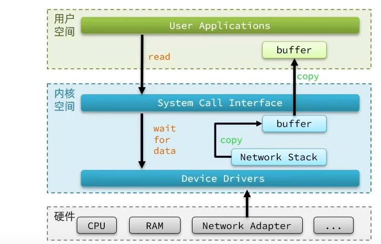

# 高级篇（四）Redis 原理篇（二）网络模型

## 1. Linux IO 模型

### 1.1 用户空间和内核空间

内核本身上来说也是一个应用，所以他本身也需要一些内存，cpu等设备资源，用户应用本身也在消耗这些资源，如果不加任何限制，用户去操作随意的去操作我们的资源，就有可能导致一些冲突，甚至有可能导致我们的系统出现无法运行的问题，因此我们需要把用户和**内核隔离开**

进程的寻址空间划分成两部分：**内核空间、用户空间**

什么是寻址空间呢？我们的应用程序也好，还是内核空间也好，都是没有办法直接去物理内存的，而是通过分配一些虚拟内存映射到物理内存中，我们的内核和应用程序去访问虚拟内存的时候，就需要一个虚拟地址，这个地址是一个无符号的整数，比如一个32位的操作系统，他的带宽就是32，他的虚拟地址就是2的32次方，也就是说他寻址的范围就是0~2的32次方， 这片寻址空间对应的就是2的32个字节，就是4GB，这个4GB，会有3个GB分给用户空间，会有1GB给内核系统

在linux中，权限分成两个等级，0和3，用户空间只能执行受限的命令（Ring3），而且不能直接调用系统资源，必须通过内核提供的接口来访问内核空间可以执行特权命令（Ring0），调用一切系统资源，所以一般情况下，用户的操作是运行在用户空间，而内核运行的数据是在内核空间的，而有的情况下，**一个应用程序需要去调用一些特权资源**，去调用一些内核空间的操作，所以此时他俩需要在用户态和内核态之间进行切换。

Linux系统为了提高IO效率，会在用户空间和内核空间都加入缓冲区：

- 写数据时，要把用户缓冲数据拷贝到内核缓冲区，然后写入设备
- 读数据时，要从设备读取数据到内核缓冲区，然后拷贝到用户缓冲区

### 1.2 五种 IO 模型

在《UNIX网络编程》一书中，总结归纳了5种IO模型：

- 阻塞IO（Blocking IO）
- 非阻塞IO（Nonblocking IO）
- IO多路复用（IO Multiplexing）
- 信号驱动IO（Signal Driven IO）
- 异步IO（Asynchronous IO）

> 应用程序想要去读取数据，他是无法直接去读取磁盘、网卡等的，有两个等待阶段：
> 1. 先到内核里边去等待内核操作硬件拿到数据
> 2. 再把这个数据写给用户的缓存区

#### 1.2.1 阻塞 IO

用户去读取数据时，会去先发起 recvform 一个命令，去尝试从内核上加载数据，如果内核没有数据，那么用户就会等待，此时内核会去从硬件上读取数据，内核读取数据之后，会把数据拷贝到用户态，并且返回ok，整个过程，都是阻塞等待的，这就是阻塞IO。

> 阻塞IO模型中，用户进程在两个阶段都是阻塞状态。

#### 1.2.2 非阻塞 IO

非阻塞IO的recvfrom操作会立即返回结果而不是阻塞用户进程。

> 非阻塞IO模型中，用户进程在第一个阶段是非阻塞，第二个阶段是阻塞状态。虽然是非阻塞，但性能并没有得到提高。而且忙等机制会导致CPU空转，CPU使用率暴增。

#### 1.2.3 IO 多路复用

用户进程如何知道内核中数据是否就绪呢？

文件描述符（File Descriptor）：简称FD，是一个从0 开始的无符号整数，用来关联Linux中的一个文件。在Linux中，一切皆文件，例如常规文件、视频、硬件设备等，当然也包括网络套接字（Socket）。

IO 多路复用：利用一个线程监听多个FD，并在某个FD可读、可写时得到通知，从而避免无效的等待，充分利用CPU资源。

监听FD的方式、通知的方式又有多种实现，常见的有：

- select
- poll
- epoll

> elect 和 pool 相当于是当被监听的数据准备好之后，他会把你监听的所有FD整个数据都发给你，你需要到所有FD中去找，哪些是处理好了的，需要通过遍历的方式，所以性能也并不是那么好。
> 
> epoll，则相当于内核准备好了之后，他会把准备好的数据，直接发给你，咱们就省去了遍历的动作。

##### 1.2.3.1 select 模式

select是Linux最早的I/O多路复用实现方案。

select 模式存在的问题：
- 需要将整个fd_set从用户空间拷贝到内核空间，select结束还要再次拷贝回用户空间
- select无法得知具体是哪个fd就绪，需要遍历整个fd_set
- fd_set监听的fd数量不能超过1024，对高并发来讲完全不够用

##### 1.2.3.2 poll 模式

poll 模式对 select 模式做了简单改进，但性能提升不明显。

与select对比：

- select模式中的fd_set大小固定为1024，而pollfd在内核中采用数组，理论上无上限
- 监听FD越多，每次遍历消耗时间也越久，性能反而会下降

##### 1.2.3.3 epoll 模式

epoll 模式是对 select 和 poll 的巨大改进。

##### 1.2.3.4 三种模式总结

select模式存在的三个问题：

- 能监听的FD最大不超过1024
- 每次select都需要把所有要监听的FD都拷贝到内核空间
- 每次都要遍历所有FD来判断就绪状态

poll模式的问题：

- poll利用链表解决了select中监听FD上限的问题，但依然要遍历所有FD，如果监听较多，性能会下降

epoll模式中如何解决这些问题的？

- 基于epoll实例中的红黑树保存要监听的FD，理论上无上限，而且增删改查效率都非常高
- 每个FD只需要执行一次epoll_ctl添加到红黑树，以后每次epol_wait无需传递任何参数，无需重复拷贝FD到内核空间
- 利用ep_poll_callback机制来监听FD状态，无需遍历所有FD，因此性能不会随监听的FD数量增多而下降

##### 1.2.3.5 事件通知机制

当FD有数据可读时，我们调用epoll_wait（或者select、poll）可以得到通知。但是事件通知的模式有两种：

- LevelTriggered：简称LT，也叫做水平触发。只要某个FD中有数据可读，每次调用epoll_wait都会得到通知，可以重复通知。Epoll 默认模式
- EdgeTriggered：简称ET，也叫做边沿触发。只有在某个FD有状态变化时，调用epoll_wait才会被通知，只通知一次。

总结：
- LT：事件通知频率较高，会有重复通知，影响性能
- ET：仅通知一次，效率高。 可以基于非阻塞IO循环读取解决数据读取不完整问题
- select和poll仅支持LT模式，epoll可以自由选择LT和ET两种模式

##### 1.2.3.6 基于 epoll 的 web 服务的基本流程

#### 1.2.4 信号驱动 IO

信号驱动IO是与内核建立SIGIO的信号关联并设置回调，当内核有FD就绪时，会发出SIGIO信号通知用户，期间用户应用可以执行其它业务，无需阻塞等待。

当有大量IO操作时，信号较多，SIGIO处理函数不能及时处理可能导致信号队列溢出，而且内核空间与用户空间的频繁信号交互性能也较低。

#### 1.2.5 异步 IO

这种方式，不仅仅是用户态在试图读取数据后，不阻塞，而且当内核的数据准备完成后，也不会阻塞。

#### 1.2.6 五种 IO 模型对比

同步还是异步关键看内核空间和用户空间的拷贝过程，也就是阶段二是同步还是异步。

## 2. Redis 网络模型

### 2.1 Redis是单线程的吗？为什么使用单线程

**Redis到底是单线程还是多线程？**

- 如果仅仅聊Redis的核心业务部分（命令处理），答案是单线程
- 如果是聊整个Redis，那么答案就是多线程

在Redis版本迭代过程中，在两个重要的时间节点上引入了多线程的支持：

- Redis v4.0：引入多线程异步处理一些耗时较旧的任务，例如异步删除命令unlink
- Redis v6.0：在核心网络模型中引入 多线程，进一步提高对于多核CPU的利用率

对于Redis的核心网络模型，在Redis 6.0之前确实都是单线程。是利用epoll（Linux系统）这样的IO多路复用技术在事件循环中不断处理客户端情况。

**为什么Redis要选择单线程？**

- 抛开持久化不谈，Redis是纯  内存操作，执行速度非常快，它的性能瓶颈是网络延迟而不是执行速度，因此多线程并不会带来巨大的性能提升。
- 多线程会导致过多的上下文切换，带来不必要的开销
- 引入多线程会面临线程安全问题，必然要引入线程锁这样的安全手段，实现复杂度增高，而且性能也会大打折扣

### 2.2 单线程和多线程模型

单线程：

多线程：

搞不懂了就看看[视频教程](https://www.bilibili.com/video/BV1cr4y1671t?p=171)

---

> 作者: [黄波](https://boh5.github.io)  
> URL: https://boh5.github.io/posts/notes/databases/redis/itheima_redis_lesson/advanced/4-redis-principle-2-network/  

