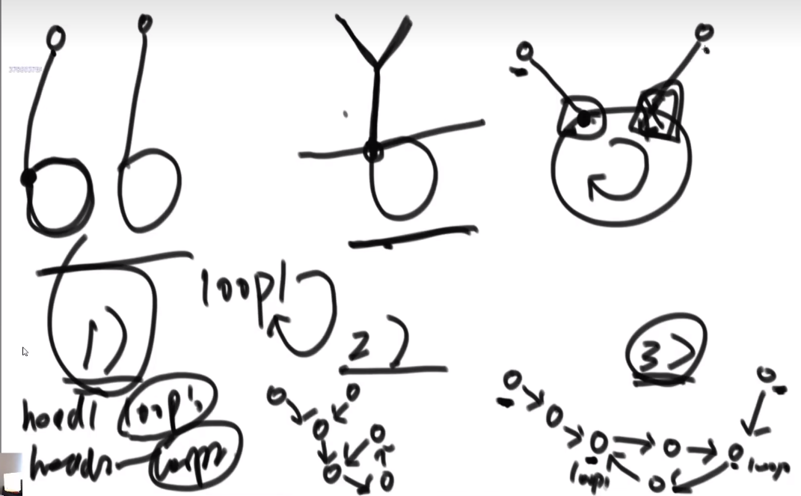

# 数据结构和算法学习笔记（二）链表

## 1. 单链表和双链表

**笔试 vs 面试**
- 笔试：时间复杂度越低越好
- 面试：时间复杂度越低越好，空间复杂度也要低

**链表题目技巧**

- 额外数据结构记录（哈希表等）
- 快慢指针

**算法题**
- [x] [206. 反转链表](https://leetcode.cn/problems/reverse-linked-list/)
- [x] 反转双向链表
- [x] [剑指 Offer II 027. 回文链表](https://leetcode.cn/problems/aMhZSa/)
  - [x] 方法1：额外栈存储遍历结果，再遍历一遍
  - [x] 方法2：在 1 的基础上栈只存一半数据，用快慢指针(慢指针走两步，快指针一次走一部)
  - [x] 方法3：在 2 的基础上，找到中点和尾节点，从两头向中间遍历
- [x] [剑指 Offer II 077. 链表排序](https://leetcode.cn/problems/7WHec2/)
- [x] [面试题 02.04. 分割链表](https://leetcode.cn/problems/partition-list-lcci/)
- [x] 在上题的基础上，更进一步分成三部分(小于、等于、大于)，时间复杂度 $O(N)$，空间复杂度$O(1)$
  - 方法：[x] 用 6 个指针记录每段的头尾，最后把 3 段串起来
- [x] [138. 复制带随机指针的链表](https://leetcode.cn/problems/copy-list-with-random-pointer/)
  - [x] 方法1：用哈希表`{old_node: new_node}`
  - [x] 方法2：遍历形成 `old1 -> new1 -> old2 -> new2 ...` 的结构，然后遍历把新节点的 random 指针设好，然后分离新老链表
- [x] [141. 环形链表](https://leetcode.cn/problems/linked-list-cycle/)
- [x] [142. 环形链表 II](https://leetcode.cn/problems/linked-list-cycle-ii/)
- [x] [剑指 Offer 52. 两个链表的第一个公共节点](https://leetcode.cn/problems/liang-ge-lian-biao-de-di-yi-ge-gong-gong-jie-dian-lcof/)
  - [x] 方法1：
    1. 两个链表遍历到头，如果最后一个节点不是同一个，不相交
    2. 长度大的先走长度差值，两个再一起走，一定会在交点相遇
    3. 统计长度用：A 走的时候 `n++`，B 走的时候 `n--`，可以节省一个变量
  - [x] 方法2：[浪漫解法](https://leetcode.cn/problems/intersection-of-two-linked-lists/solution/jiao-ni-yong-lang-man-de-fang-shi-zhao-dao-liang-2/)
  - [x] 方法3：
    1. A 逆序，A 原始头节点指向 B 的头节点
    2. 如果不成环，说明不相交
    3. 成环找出环入口即为答案，再还原两个链表
- [ ] 在上题的基础上，链表可能有环。时间复杂度 $O(N)$，空间复杂度 $O(1)$
  - [ ] 方法：
    1. 分别判断两个链表是否有环
    2. 如果都没有环，按上题处理
    3. 如果一个有环，一个没环，不可能相交
    4. 如果都有环：
       - 如果环起点是同一个节点，那么说明他们在环起点上或之前相交，把环节点看出链表终止节点，按上述方法处理
       - 如果环起点不是同一个，一个环起点继续走
         - 如果走回到原位置，还没碰到另一个环起点，那么他们不相交
         - 如果碰到了，那么任意一个环起点都是第一个交点

---

> 作者: [黄波](https://boh5.github.io)  
> URL: https://boh5.github.io/posts/notes/datastructure_algorithm/zuochengyun/2-linked-list/  

