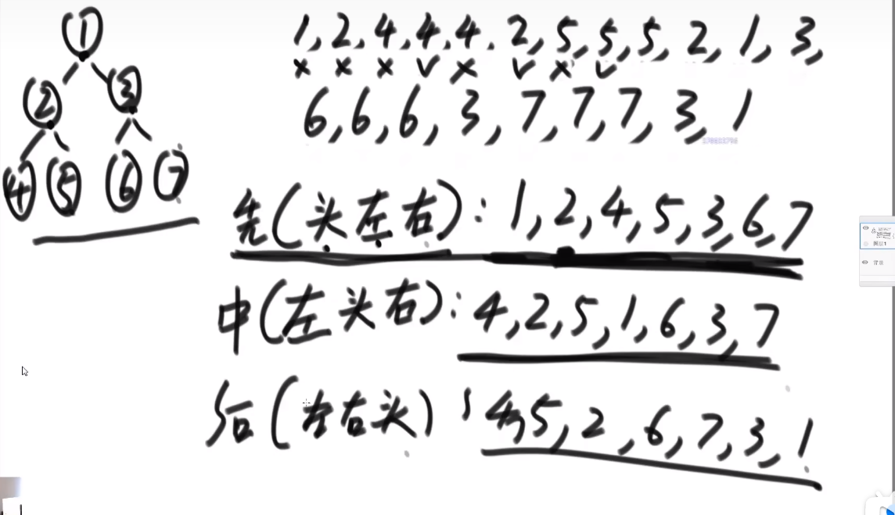

# 数据结构和算法学习笔记（三）二叉树


## 1. 遍历二叉树

**递归序**



`1,2,4,4,4,2,5,5,5,2,1,3,6,6,6,3,7,7,7,3,1` 即为递归序

**先序遍历**

- 对于每棵子树，先打印头节点，再打印左子树，再打印右子树
- 在递归序中，只有第一次碰到，才打印

**中序遍历**

- 对于每棵子树，先打印左子树，再打印头节点，再打印右子树
- 在递归序中，只有第二次碰到，才打印

**后序遍历**

- 对于每棵子树，先打印头节点，再打印左子树，再打印右子树
- 在递归序中，只有第三次碰到，才打印

**非递归实现**

> 任何递归都可以改为非递归：自己压栈不就得了

- 先序遍历
  1. 准备一个栈
  2. 头节点压栈
  3. 弹出一个节点，打印
  4. 先压右节点，再压左节点
  5. 回到第 `3` 步

- 中序遍历
  1. 准备一个栈
  2. 从头节点开始，依次把所有左边界(一路顺着 `left` 走，直到没有 `left`)节点压栈(包括头节点)
  3. 弹出一个节点，打印
  4. 弹出的节点如果有右子树，回到第 `2` 步

- 后序遍历
  1. 准备两个栈 `s1`, `s2`
  2. 头节点压 `s1`
  3. 弹出一个节点，放入 `s2`
  4. `s1` 先压左节点，再压右节点
  5. 回到第 `3` 步
  6. 循环完成后，依次弹出 `s2` 打印

**算法题**

- [x] 递归和非递归的实现二叉树的先序、中序、后序遍历
  - [x] [144. 二叉树的前序遍历](https://leetcode.cn/problems/binary-tree-preorder-traversal/)
  - [x] [94. 二叉树的中序遍历](https://leetcode.cn/problems/binary-tree-inorder-traversal/)
  - [x] [145. 二叉树的后序遍历](https://leetcode.cn/problems/binary-tree-postorder-traversal/)
- [x] [655. 输出二叉树](https://leetcode.cn/problems/print-binary-tree/)

```python
# Definition for a binary tree node.
# class TreeNode:
#     def __init__(self, val=0, left=None, right=None):
#         self.val = val
#         self.left = left
#         self.right = right
class Solution:
    def printTree(self, root: Optional[TreeNode]) -> List[List[str]]:
        
        def max_depth(root):
            return max(max_depth(root.left) + 1 if root.left else 0, max_depth(root.right) + 1 if root.right else 0)
        
        height = max_depth(root)
        m = height + 1
        n = 2 ** (height + 1) - 1

        ans = [[''] * n for _ in range(m)]

        def dfs(root, r, c):
            ans[r][c] = str(root.val)
            if root.left:
                dfs(root.left, r + 1, c - 2 ** (height - r - 1))
            if root.right:
                dfs(root.right, r + 1, c + 2 ** (height - r - 1))
        
        dfs(root, 0, (n - 1) // 2)

        return ans
```
- [x] [102. 二叉树的层序遍历](https://leetcode.cn/problems/binary-tree-level-order-traversal/)
  - 广度优先遍历：
    1. 头节点入队列
    2. 弹出节点，打印
    3. 左子节点入队列，右子节点入队列
    4. 回到步骤 `1`
- [x] [662. 二叉树最大宽度](https://leetcode.cn/problems/maximum-width-of-binary-tree/)
  - 注意：不能硬把每层的节点(包括空节点)记下来，然后去数，否则多层之后，中间空节点可能成 `2 ^ cur_depth` 指数级增加，导致超时
  - 方法：要记录每个节点的 `postion`，把空间的算上，是一颗完全二叉树，可根据堆排序知识点算 `position`，用 position 相减，避免指数级空节点
  
## 2. 二叉树的相关概念及判断

### 2.1 二叉搜索树

> 若它的左子树不空，则**左子树**上所有结点的值均**小于**它的根结点的值； 若它的右子树不空，则**右子树**上所有结点的值均**大于**它的根结点的值

**判定**：

1. 二叉搜索树的**中序遍历是递增的**

2. 按定义：
   1. 左子树是搜索二叉树
   2. 右子树是搜索二叉树
   3. `left_max < node.val < right.min`

**算法题**：

- [x] [98. 验证二叉搜索树](https://leetcode.cn/problems/validate-binary-search-tree/)

### 2.2 完全二叉树

> - 叶子结点只能出现在最下层和次下层，且最下层的叶子结点集中在树的左部。
> - 即：最后一层可能不满，但左边一定是连续的

**判定**：

1. 广度优先搜索：

   1. 任一节点如果有右孩子，没有左孩子，返回 `False`
   2. `条件 1` 不触发的前提下，遇到第一个左右孩子不全的节点，后面必须全是叶子节点，否则返回 `False`

2. 数索引：

   1. 按堆排序类似的索引法：`idx_left == idx * 2 + 1`, `idx_right == idx * 2 + 2` 给每个节点定索引
   2. 最后一个节点的索引等于节点总数加 1，否则返回 `False`

**算法题**

- [x] [958. 二叉树的完全性检验](https://leetcode.cn/problems/check-completeness-of-a-binary-tree/)

### 2.3 满二叉树

> - 国际定义：一棵二叉树的节点要么是叶子结点，要么它有两个子节点
> - 国内定义：每层的结点数都达到最大值(国际定义为：[Perfect binary tree](https://en.wikipedia.org/wiki/Binary_tree#Types_of_binary_trees))

### 2.4 平衡二叉树 (AVL树)

> 左子树和右子树的高度之差(平衡因子)的绝对值不超过1且它的左子树和右子树都是一颗平衡二叉树

**判定**：

满足三个条件：

1. 左子树是平衡二叉树
2. 右子树是平衡二叉树
3. 左右子树高度差不超过 1

> 求高度和判定当前是否为平衡二叉树，可在一个函数中完成：函数返回两个值`<bool:is_avl, int:height>` 即可

**算法题**：

- [x] [剑指 Offer 55 - II. 平衡二叉树](https://leetcode.cn/problems/ping-heng-er-cha-shu-lcof/)

### 2.5 解题套路

**问子树要信息**(分解成子问题，如上述平衡二叉树判定)，可解决**树型DP**问题


---

> 作者: [黄波](https://dilless.github.io)  
> URL: https://dilless.github.io/posts/notes/datastructure_algorithm/zuochengyun/3-binary-tree/  

