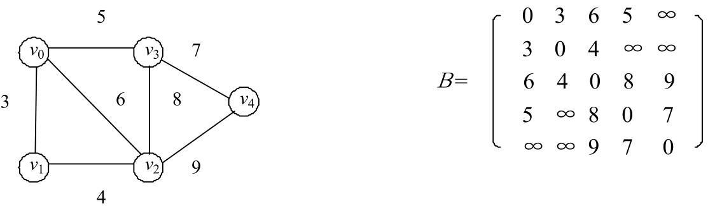

# 数据结构和算法学习笔记（四）图


## 1. 图的数据结构

- 图分为 `有向图` 和 `无向图`

**图的一种数据结构**：

```go
package graph

type Edge struct {
	Weight int   // 权重(距离...)
	From   *Node // 从哪个 Node 出发
	To     *Node // 到哪个 Node 去
}

type Node struct {
	Value int     // 值
	In    int     // 入度，几条边进来
	Out   int     // 出度，几条边出去
	Nexts []*Node // 出去指向的节点列表
	Edges []*Edge // 哪些边属于自己(从自己出去)
}

type Graph struct {
	Nodes map[int]*Node // Node 编号 -> Node
	Edges map[*Edge]any // 边 Set
}
```

### 1.1 邻接表


### 1.2 邻接矩阵



## 2. 图的遍历

### 2.1 广度优先遍历

```go
package graph

func BFS(node *Node) []*Node {
	if node == nil {
		return nil
	}

	queue := make([]*Node, 0)
	set := make(map[*Node]any)
	rtn := make([]*Node, 0)

	queue = append(queue, node)
	set[node] = nil

	for len(queue) > 0 {
		curNode := queue[0]
		queue = queue[1:]
		rtn = append(rtn, curNode)

		for _, next := range curNode.Nexts {
			if _, ok := set[next]; !ok {
				queue = append(queue, next)
				set[next] = nil
			}
		}
	}

	return rtn
}
```

### 2.2 深度优先遍历

```go
package graph

func DFS(node *Node) []*Node {
	if node == nil {
		return nil
	}

	stack := make([]*Node, 0)
	set := make(map[*Node]any)
	rtn := make([]*Node, 0)

	stack = append(stack, node)
	set[node] = nil
	rtn = append(rtn, node)


	for len(stack) > 0 {
		curNode := stack[len(stack)-1]
		stack = stack[:len(stack)-1]

		for _, next := range curNode.Nexts {
			if _, ok := set[next]; !ok {
				stack = append(stack, curNode, next)
				set[next] = nil
				rtn = append(rtn, curNode)
				break
			}
		}
	}
	return rtn
}
```

## 3. 拓扑排序算法

> [维基百科](https://zh.wikipedia.org/wiki/%E6%8B%93%E6%92%B2%E6%8E%92%E5%BA%8F)
> 
> 在计算机科学领域，有向图的拓扑排序或拓扑测序是对其顶点的一种线性排序，使得对于从顶点 u 到顶点 v 的每个有向边 uv，u 在排序中都在 v 之前。
>
> 例如，图形的顶点可以表示要执行的任务，并且边可以表示一个任务必须在另一个任务之前执行的约束；在这个应用中，拓扑排序只是一个有效的任务顺序。
> 
> 再如，项目中各个包的依赖顺序(引入顺序、编译顺序)

**算法**：

- 入度为 0 的点为起点，加入返回值列表
- 去掉该点，重复上一步
- 直到所有点去掉

**实现**：

```go
package graph

func TopologySort(graph *Graph) []*Node {
	inMap := make(map[*Node]int)    // 记录 Node 剩余的入度
	zeroInQueue := make([]*Node, 0) // 入读为 0 的点才能进入队列
	rtn := make([]*Node, 0)

	// 找第一批入度为 0 的点
	for _, node := range graph.Nodes {
		inMap[node] = node.In
		if node.In == 0 {
			zeroInQueue = append(zeroInQueue, node)
		}
	}

	for len(zeroInQueue) > 0 {
		node := zeroInQueue[0]
		zeroInQueue = zeroInQueue[1:]
		rtn = append(rtn, node)

		// 擦除当前 node 对 next node 入度的影响
		for _, next := range node.Nexts {
			inMap[next]--
			if inMap[next] == 0 {
				zeroInQueue = append(zeroInQueue, next)
			}
		}
	}
	return rtn
}
```

## 3. kruskal算法和 prim算法

**只适用于无向图**

### 3.1 最小生成树

> [维基百科](https://zh.m.wikipedia.org/zh-hans/%E6%9C%80%E5%B0%8F%E7%94%9F%E6%88%90%E6%A0%91)
> 
> 最小生成树是一副连通加权无向图中一棵权值最小的生成树。
> 
> 最小生成树其实是最小权重生成树的简称。

### 3.2 kruskal算法

> 从边的角度考虑这件事

**算法**

1. 找到权重最小的边，加入树中
2. 选取剩余的边中权重最小的边
   - 如果会形成环，跳过
   - 如果不会形成环，加入树中
3. 循环第 2 步，直到遍历完所有的边

**关键问题**在于如何判断加入一个边是否会形成环，采用**并查集**解决

**并查集算法**

1. 一开始每个 node 都是单独的集合
2. 每次选中最小边时，判断边的两个 node 是否是同一个集合：
   - 是：跳过
   - 不是：加入这条边，两个 node 的集合合并

**Golang实现**:

```go
package graph

import (
	"container/heap"
	"reflect"
)

// TODO: Test

// UnionFinder 定义并查集算法
type UnionFinder interface {
	IsSameSet(from, to *Node) bool
	Union(from, to *Node)
}

// MySets 简单实现类似并查集的算法
type MySets struct {
	SetMap map[*Node][]*Node
}

func NewMySets(nodes []*Node) *MySets {
	mySets := new(MySets)
	for _, node := range nodes {
		mySets.SetMap[node] = []*Node{node}
	}
	return mySets
}

// IsSameSet 判断两个 node 对应的 set 是否相同
func (s *MySets) IsSameSet(from, to *Node) bool {
	fromSet := s.SetMap[from]
	toSet := s.SetMap[to]
	return reflect.DeepEqual(fromSet, toSet)
}

// Union 合并两个 node 对应的 set
func (s *MySets) Union(from, to *Node) {
	fromSet := s.SetMap[from]
	toSet := s.SetMap[to]

	for _, node := range toSet {
		fromSet = append(fromSet, node)
		s.SetMap[node] = fromSet
	}
}

// A EdgeHeap implements heap.Interface and holds Edge.
type EdgeHeap []*Edge

func (pq EdgeHeap) Len() int { return len(pq) }

func (pq EdgeHeap) Less(i, j int) bool {
	// We want Pop to give us the lowest
	return pq[i].Weight < pq[j].Weight
}

func (pq EdgeHeap) Swap(i, j int) {
	pq[i], pq[j] = pq[j], pq[i]
}

func (pq *EdgeHeap) Push(edge any) {
	item := edge.(*Edge)
	*pq = append(*pq, item) // 必须传指针，否则 append 新开辟内存，导致 push 失效
}

func (pq *EdgeHeap) Pop() any {
	old := *pq
	n := len(old)
	edge := old[n-1]
	old[n-1] = nil // avoid memory leak
	*pq = old[0 : n-1]
	return edge
}

// Kruskal 实现最小生成树算法
func Kruskal(graph *Graph, newFinderFunc func(nodes []*Node) UnionFinder) []*Edge {
	nodes := make([]*Node, 0, len(graph.Nodes))
	for _, node := range graph.Nodes {
		nodes = append(nodes, node)
	}
	finder := newFinderFunc(nodes)

	edgeHeap := make(EdgeHeap, 0, len(graph.Edges))
	for edge := range graph.Edges {
		edgeHeap = append(edgeHeap, edge)
	}
	heap.Init(&edgeHeap)

	result := make([]*Edge, 0)
	for edgeHeap.Len() > 0 {
		item := edgeHeap.Pop()
		edge := item.(*Edge)
		if !finder.IsSameSet(edge.From, edge.To) {
			result = append(result, edge)
			finder.Union(edge.From, edge.To)
		}
	}

	return result
}
```

### 3.3 prim 算法

> 从点的角度考虑

**算法**

1. 初始化：所有的 edge 都没解锁
2. 从任意 node 开始，解锁相关所有边
3. 在解锁的边中找出最小的 edge：
   - 如果另一个 node 还没考察过，则将 edge 放入结果集
   - 否则，排除这条 edge，回到第 3 步
4. 将解锁的 edge 的另一个 node 的所有 edge 解锁
5. 重复第 3 步


### 3.4 kruskal算法 VS prim算法

- K 算法从边考虑，可能形成几片连接的树最后才连起来，因此需要并查集来考虑合并问题
- P 算法从点考虑，从某个点出发依次连接各个点(因为每次考虑的边都靠解锁的方式和已加入结果的点相连，不可能存在多片独立的树)，不存在上述问题


## 4. Dijkstra 算法

> 是从一个顶点到其余各顶点的最短路径算法，解决的是有权图中最短路径问题
>
> 要求边的权重不能为负，更准确是：不能有累加和为负数的环，否则一直在环上绕就会越来越小

**算法**:

1. 一开始从 A 出发记录 A 到各个点的距离，最开始为 [0, INF, INF, ...]，0 表示 A 到 A 的距离
2. 每次选中距离最小的点，最开始选中 A，如果从 A 发出到其他点的距离会缩小，那么更新距离，完成后锁定当前距离，不再更新：
   - 如 A 到 B 距离为 3，A 和 其他点都不相连，那么数组变成 [0, 3, INF, ...]，锁定 0 这个位置，不再更新
3. 重复 2，直到全部锁定，即为 A 到各个点的最小路径

**Golang**实现：

```go
package graph

import "math"

func Dijkstra(head *Node) map[*Node]int {
	// distanceMap 记录从 head 出发到各个 node，目前发现的最小距离
	// key 表示从 head 出发到达 key
	// value 表示从 head 出发到达 key 的最小距离
	// 如果没有 node 不在 distanceMap 中，表示距离为正无穷
	distanceMap := make(map[*Node]int)
	distanceMap[head] = 0 // head 到 head 距离为 0

	// selectedNode 储存已锁定(已经选择过)的节点
	selectedNodes := make(map[*Node]any)

	minNode := getMinDistanceAndUnselectedNode(distanceMap, selectedNodes)
	for minNode != nil {
		preDistance := distanceMap[minNode] // 当前节点到 head 的距离
		for _, edge := range minNode.Edges {
			toNode := edge.To
			// distanceMap 中没出现过，说明是正无穷，说明当前距离一定更小，因此更新距离
			if _, ok := distanceMap[toNode]; ok {
				distanceMap[toNode] = preDistance + edge.Weight
			}
			// 已记录的距离，和从当前节点过去的距离，哪个更小就要哪个
			distanceMap[toNode] = int(math.Min(float64(distanceMap[toNode]), float64(preDistance+edge.Weight)))
		}
		selectedNodes[minNode] = nil // 当前节点加入锁定 map
		minNode = getMinDistanceAndUnselectedNode(distanceMap, selectedNodes)
	}
	return distanceMap
}

// getMinDistanceAndUnselectedNode 返回未被选择过的最小距离节点
func getMinDistanceAndUnselectedNode(distanceMap map[*Node]int, selectedNodes map[*Node]any) *Node {
	var minNode *Node
	minDistance := math.MaxInt
	for node, distance := range distanceMap {
		if _, ok := selectedNodes[node]; !ok && distance < minDistance {
			minNode = node
			minDistance = distance
		}
	}
	return minNode
}
```

---

> 作者: [黄波](https://boh5.github.io)  
> URL: https://boh5.github.io/posts/notes/datastructure_algorithm/zuochengyun/4-graph/  

