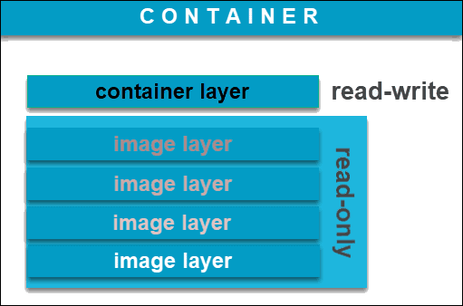
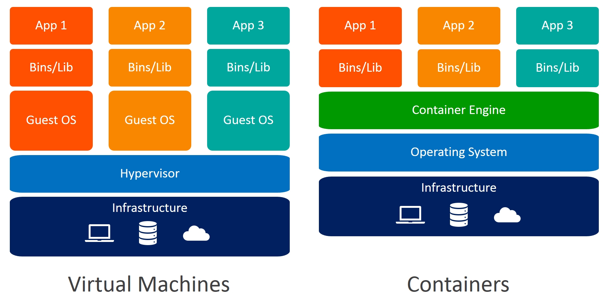

# Docker 学习笔记（二）容器快速上手

## 1. Docker 命令行基本操作

docker + 管理的对象（比如容器，镜像） + 具体操作（比如创建，启动，停止，删除）

- `docker image pull nginx`： 拉取一个叫nginx的docker image镜像
- `docker container stop web`： 停止一个叫web的docker container容器

## 2. Image vs Container

**image 镜像**
- Docker image是一个 `read-only` 文件
- 这个文件包含文件系统，源码，库文件，依赖，工具等一些运行application所需要的文件
- 可以理解成一个模板
- docker image具有分层的概念

**container 容器**
- “一个运行中的docker image”
- 实质是复制image并在image最上层加上一层 `read-write` 的层 （称之为 container layer ,容器层）
- 基于同一个image可以创建多个container

## 3. 容器的基本操作

| 操作                            | 命令(全)(*新版本*)                       | 命令(简)(*旧版本*)                       |
|-------------------------------|------------------------------------|------------------------------------|
| 容器的创建                         | docker container run <image name>  | docker run <image name>            |
| 容器的列出(up)                     | docker container ls                | docker ps                          |
| 容器的列出(up和exit)                | docker container ls -a             | docker ps -a                       |
| 容器的停止                         | docker container stop <name or ID> | docker stop <container name or ID> |
| 容器的删除(不能删除运行中的容器，除非添加参数 `-f`) | docker container rm <name or ID>   | docker rm <container name or ID>   |

## 4. 批量操作

- `docker container stop cd3 269 34b 751`：输入多个 id
- `docker container stop $(docker container ps -aq)`：`$` 符号传递 stdout(`-q` 只显示 id)
- `docker system prune -af`： 快速对系统进行清理，删除停止的容器，不用的image，等等

## 5. 容器的 attached 和 detached 模式

- attached 模式在前台运行
- detached 模式在后台运行，`docker container run -d xxx` 开启
- detached 模式转 attached：`docker attach <ID or Name>`
- detached 模式查看日志：`docker container logs [-f] <ID or Name>`(-f：动态跟踪打印)

## 6. 连接容器的 shell

- `docker container run -it <ID or Name> [sh | bash ...]` 创建一个容器并进入交互式模式
- `docker container exec -it <ID or Name> [sh | bash ...]` 在一个已经运行的容器里执行一个额外的command

## 7. 容器 vs 虚拟机

**容器不是虚拟机**：

- 容器其实是进程Containers are just processes
- 容器中的进程被限制了对CPU内存等资源的访问
- 当进程停止后，容器就退出了

## 8. docker container run 背后发生了什么？

`$ docker container run -d --publish 80:80 --name webhost nginx`:

1. 在本地查找是否有nginx这个image镜像，但是没有发现
2. 去远程的image registry查找nginx镜像（默认的registry是Docker Hub)
3. 下载最新版本的nginx镜像 （nginx:latest 默认)
4. 基于nginx镜像来创建一个新的容器，并且准备运行
5. docker engine分配给这个容器一个虚拟IP地址
6. 在宿主机上打开80端口并把容器的80端口转发到宿主机上
7. 启动容器，运行指定的命令（这里是一个shell脚本去启动nginx）

---

> 作者: [黄波](https://boh5.com)  
> URL: https://boh5.com/posts/notes/devops/docker/imooc/2-container-basic/  

