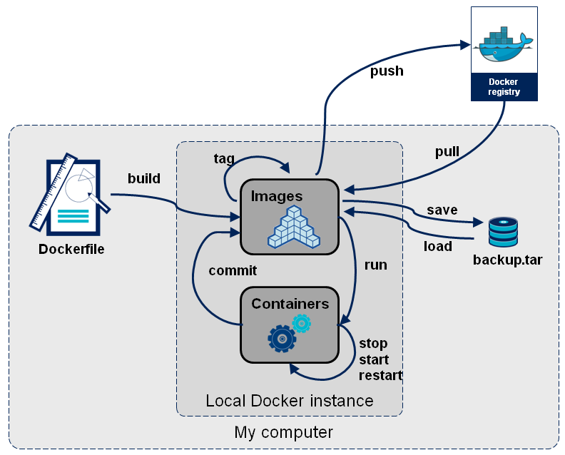

# Docker 学习笔记（三）镜像的创建管理和发布


## 1. 镜像的获取



三种方式： 
1. pull from `registry` (online) 从registry拉取
  - public（公有）
  - private（私有）
2. build from `Dockerfile` (online) 从Dockerfile构建
3. load from `file` (offline) 文件导入 （离线）

## 2. Registry

[DockerHub](https://hub.docker.com/)
[Quay](https://quay.io/)

## 3. 镜像的基本操作

- 拉取镜像：`docker image pull name[:tag]`，`docker image pull quay.io/bitnami/nginx`
- 查看镜像：`docker image ls`
- 镜像详情：`docker image inspect <ID or Name>`
- 删除镜像：`docker image rm <ID or Name>`

## 4. 镜像的导出和导入 (offline)

- 导出：`docker image save <ID or Name> -o <path_to_file>`
- 导入：`docker image load -i <path_to_file>`

## 5. Dockerfile 介绍

Dockerfile 基本结构：

```dockerfile
FROM ubuntu:20.04
RUN apt-get update && \
    DEBIAN_FRONTEND=noninteractive apt-get install --no-install-recommends -y python3.9 python3-pip python3.9-dev
ADD hello.py /
CMD ["python3", "/hello.py"]
```

- `FROM`：基础镜像
- `RUN`：执行命令
- `ADD`：添加文件
- `CMD`：启动容器执行的命令

## 6. 镜像的构建和分享

- 构建：`docker image build -t <name>[:tag] <path_to_dockerfile>`
- 通过存在的 image 添加 tag：`docker image tag SOURCE_IMAGE[:TAG] TARGET_IMAGE[:TAG]` 
- 登录：`docker login`
- push：`docker image push <Name>[:tag]`(要把 image name 构建成 `docker-hub-account-name/image-name[:tag]` 才能 push 到自己的仓库)

## 7. 通过 commit 创建镜像

对容器的操作会保存到容器中，可以通过 `docker container commit CONTAINER [REPOSITORY[:TAG]]` 来创建镜像，相当于保存当前容器

## 8. scratch 镜像

- 查看镜像分层：`docker image history <image>`


---

> 作者: [黄波](https://boh5.com)  
> URL: https://boh5.com/posts/notes/devops/docker/imooc/3-image/  

