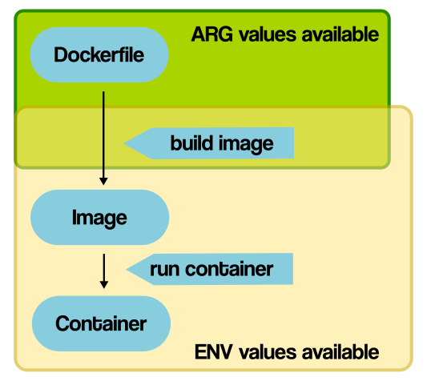

# Docker 学习笔记（四）Dockerfile


## 1. 镜像的选择(FROM)

- 官方镜像优于非官方的镜像，如果没有官方镜像，则尽量选择Dockerfile开源的
- **固定版本tag**而不是每次都使用latest
- 尽量选择**体积小**的镜像(-alpine)

## 2. 通过 RUN 执行指令

- `RUN` 主要用于在Image里执行指令，比如安装软件，下载文件等
- 不要写多个 `RUN`，每一行的 RUN 命令都会产生一层 image layer , 导致镜像的臃肿，应该通过 `&&` 拼接多个指令

## 3. 文件复制和目录操作

### 3.1 COPY vs ADD

- `COPY` 和 `ADD` 都能复制，如果目标目录不存在会**自动创建**，权限也会复制过去
- `ADD` 复制压缩文件时会**自动解压**
- 选择：所有的文件复制均使用 `COPY` 指令，**仅**在需要自动解压缩的场合使用 `ADD`

### 3.2 WORKDIR

- `WORKDIR`：切换工作目录，类似 `cd` 命令，如果目录不存在则**自动创建**


## 4. 构建参数和环境变量(ARG vs ENV)

- 语法：`{ENV|ARG} KEY=VALUE`
- `ARG` 和 `ENV` 是经常容易被混淆的两个Dockerfile的语法，都可以用来设置一个“变量”。在 Dockerfile 中通过 `${KEY}` 引用。

区别：



- `ARG`：**参数**，可以在镜像build的时候动态修改value, 通过 `--build-arg`
- `ENV`：**环境变量**，设置的变量可以在Image中保持，并在容器中的环境变量里

## 5. 容器启动命令 

### 5.1 CMD

- 容器启动时默认执行的命令
- 如果docker container run启动容器时指定了其它命令，则CMD命令会被忽略
- 如果定义了多个CMD，只有最后一个会被执行。
- `CMD []` 会覆盖掉之前的 CMD
- `docker container run --rm`：退出后自动删除 container

### 5.2 ENTRYPOINT

ENTRYPOINT 也可以设置容器启动时要执行的命令，但是和CMD是有区别的:

- `CMD` 设置的命令，可以在docker container run 时传入其它命令，覆盖掉 `CMD` 的命令，但是 `ENTRYPOINT` 所设置的命令是**一定**会被执行的，`docker container run` 传入的命令和参数会全部作为参数传入 `ENTRYPOINT` 指定的命令
- `ENTRYPOINT` 和 `CMD` 可以联合使用，`ENTRYPOINT` 设置执行的命令，`CMD`传递参数

### 5.3 Shell 格式和 Exec 格式

- Shell 格式：`CMD echo "hello docker"`
- Exec 格式：`CMD ["echo", "hello docker"]`

## 6. Dockerfile 最佳实践

### 6.1 合理使用缓存

- 某一层发生变化(包括 COPY 的文件内容的变化)，之后的所有层都不会使用缓存。因此经常改变的层要尽量**放到后面**

### 6.2 合理使用 .dockerignore

#### 6.2.1 Docker build context

- Docker是client-server架构，理论上Client和Server可以不在一台机器上
- 在构建docker镜像的时候，需要把所需要的文件由CLI（client）发给Server，这些文件实际上就是build context
- `docker image build .` 里面的 `.` 表示当前目录为 build context

#### 6.2.2 .dockerignore

- 使用 `.dockerignore` 忽略无关的文件，可减少 build context 的大小

### 6.3 多阶段构建

多阶段构建：在同一个 Dockerfile 中写多个构建步骤，可以使编译环境和运行环境分离，减少 image 大小

关键语法：
- 在前置步骤中以 `FROM xxx AS <name>` 的形式，给当前构建步骤命名
- 在后续步骤中以 `--from=<name>`，从前置步骤中引用文件

如：
```dockerfile
FROM gcc:9.4 AS builder

COPY hello.c /src/hello.c

WORKDIR /src

RUN gcc --static -o hello hello.c


FROM alpine:3.13.5

COPY --from=builder /src/hello /src/hello

ENTRYPOINT [ "/src/hello" ]

CMD []
```

### 6.4 尽量不要用 root 用户

#### 6.4.1 docker root 用户的危险性

docker的root权限一直是其遭受诟病的地方，docker的root权限有那么危险

如：
- 我们有一个用户，叫demo，它本身不具有sudo的权限，所以就有很多文件无法进行读写操作，比如/root目录它是无法查看的
- 但是这个用户有执行docker的权限，也就是它在docker这个group里
- 我们就可以通过Docker做很多越权的事情了，比如，我们可以把这个无法查看的/root目录映射到docker container里，你就可以自由进行查看了
- 更甚至我们可以给我们自己加sudo权限，`docker run -it -v /etc/sudoers:/root/sudoers busybox sh`

#### 6.4.2 使用非 root 用户(USER)

```dockerfile
USER test
```
- 使用 `USER` 指令指定用户
- `USER` 指令和 `WORKDIR` 相似，都是改变环境状态并影响以后的层，USER 则是改变之后层的执行 `RUN`, `CMD` 以及 `ENTRYPOINT` 这类命令的身份
- `USER` 只是帮助你切换到指定用户而已，这个用户**必须**是**事先建立**好的，否则无法切换：`RUN groupadd -r <group-name> && useradd -r -g <group-name> <user-name>`


---

> 作者: [黄波](https://boh5.github.io)  
> URL: https://boh5.github.io/posts/notes/devops/docker/imooc/4-dockerfile/  

