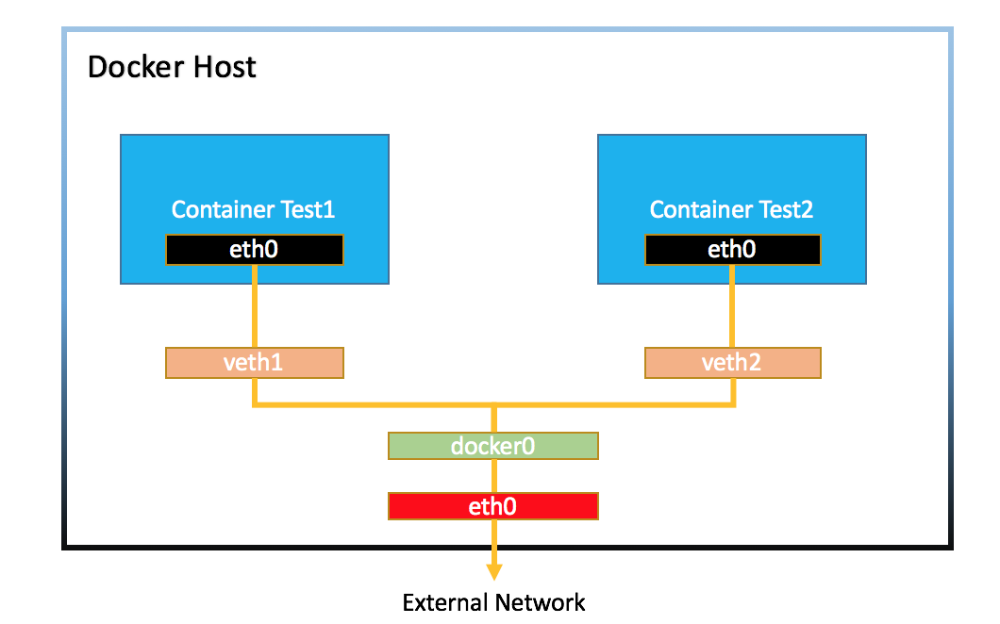

# Docker 学习笔记（六）网络

## 1. 网络基础知识

### 1.1 URL

- URL：Uniform Resource Locator（统一资源定位符），网络中每一个资源对应的唯一地址

### 1.2 IP 地址

- IP地址是IP协议提供的一种统一的地址格式，它为互联网上的每一个网络和每一台主机分配一个逻辑地址，以此来屏蔽物理地址(MAC地址)。
- 是32位二进制数据，通常以十进制表示，并以“.”分隔。IP地址是一种逻辑地址，用来标识网络中一个个主机，在本地局域网上是惟一的。

### 1.3 IP 协议

- 它是能使连接到网上的所有计算机网络实现相互通信的一套规则，规定了计算机在因特网上进行通信时应当遵守的规则。任何厂家生产的计算机系统，只要遵守IP协议就可以与因特网互连互通。

### 1.4 子网掩码

- 互联网是由许多小型网络构成的，每个网络上都有许多主机，这样便构成了一个有层次的结构。IP地址在设计时就考虑到地址分配的层次特点，将每个IP地址都分割成网络号和主机号两部分，以便于IP地址的寻址操作。
- 如果不指定，就不知道哪些位是网络号、哪些是主机号，这就需要通过子网掩码来实现。
- 子网掩码只有一个作用，就是将某个IP地址划分成网络地址和主机地址两部分。
- 子网掩码的长度也是32位，左边是网络位，用二进制数字“1”表示；右边是主机位，用二进制数字“0”表示。
- 假设IP地址为“192.168.1.1”子网掩码为“255.255.255.0”。其中，“1”有24个，代表与此相对应的IP地址左边24位是网络号；“0”有8个，代表与此相对应的IP地址右边8位是主机号。
- 例如：
  - 子网掩码是“255.255.255.0”的网络：最后面一个数字可以在0~255范围内任意变化，因此可以提供256个IP地址。但是实际可用的IP地址数量是256-2，即254个，因为主机号不能全是“0”或全是“1”(二进制角度)。
  - 子网掩码是“255.255.0.0”的网络：后面两个数字可以在0~255范围内任意变化，可以提供255²个IP地址。但是实际可用的IP地址数量是255²-2，即65023个。
- ip 地址后面加斜线 '\'，斜线后面的数字表示子网掩码中 '1' 的数量，如：
  - xx.xx.xx.2/24： ip 地址为 xx.xx.xx.2，子网掩码为：255.255.255.0
  - xx.xx.xx.0/24：网段：xx.xx.xx.0，子网掩码：255.255.255.0

### 1.5 网关

- 网关实质上是一个网络通向其他网络的IP地址。
- 比如有网络A和网络B，网络A的IP地址范围为“192.168.1.1~192.168.1.254”，子网掩码为255.255.255.0；网络B的IP地址范围为“192.168.2.1~192.168.2.254”，子网掩码为255.255.255.0。TCP/IP协议会根据子网掩码（255.255.255.0）判定两个网络中的主机处在不同的网络里。而要实现这两个网络之间的通信，则必须通过网关。
- 如果网络A中的主机发现数据包的目标主机不在本地网络中，就把数据包转发给它自己的网关，再由网关转发给网络B的网关，网络B的网关再转发给网络B的某个主机。
- 网关的IP地址是具有**路由功能**的设备的IP地址，具有路由功能的设备有路由器、启用了路由协议的服务器（实质上相当于一台路由器）、代理服务器（也相当于一台路由器）。

### 1.6 DNS 服务器

- 域名与 IP 地址的转换工作成为域名解析，DNS就是进行域名解析的服务器 。

## 2. 网络常用命令

- IP 地址查看：`ifconfig` 或 `ip addr`
- 连通性测试：
  - `ping`
  - `telnet <ip or domain> <port>`：测试端口的连通性
  - `tracepath <ip or domain>`：路径探测跟踪

## 3. Bridge 网络

- 默认创建的容器会连接到 `docker0` linux bridge 上
- 访问外网时，会进行 NAT 转换，转换为宿主机的 IP 地址，对于外网服务，并不知道是由 docker 发出的，而是认为是宿主机发出的
- NAT：
  - NAT 主要为了解决 IPV4 地址数量不足的问题
  - IPV4 地址不足以使每个设备拥有一个 IP，因此有了 Public 和 Private 两种 IP 地址，我们的设备使用私有 IP，公网 IP 由网络提供商管理。
  - NAT就是，我们的设备出口流量时转为公网ip，收到返回后再转回私有ip
- 创建 Bridge 网络：`docker network create -d bridge <name>`
- 创建容器时指定 network：`--network <docker-network-name>`
- 为容器[添加|移除]网络连接：`docker network {connect|disconnect} <docker-network-name> <container-ID-or-Name>`
- 在容器中访问其他容器时，可通过 ip，也可通过container name(通过 docker network 提供的 dns 功能实现)，**默认的** bridge(`ip addr`: docker0，`docker network ls`：bridge) **不提供**这个功能，只能通过 ip 访问，因此建议使用自己创建的 bridge
- NAT 反过来(公网->私网)不行，docker 外网无法直接容器内部，因此需要进行端口映射：`-p <宿主机port>:<容器port>`
- `EXPOSE` 指令：声明容器运行时提供服务的端口，这只是一个声明，在容器运行时并不会因为这个声明应用就会开启这个端口的服务。在运行时使用随机端口映射时，也就是 `docker run -P` 时，会自动随机映射 `EXPOSE` 的端口。

## 4. Host 网络

- 容器和宿主机使用**同一个**网络
- `docker network ls` 可以查到一个 name 为 host 的网络，创建容器时使用 `--network host` 来使用 host 网络
- `docker network ls` 还可以看到一个 name 为 none 的网络，意为 docker 仅创建容器，不要管网络了，由我们自己处理
- 走 Bridge 会有 NAT 的性能损耗，使用 Host 理论上性能更好

## 5. 网络命名空间

- Linux的Namespace（命名空间）技术是一种隔离技术，常用的Namespace有 user namespace, process namespace, network namespace等
- 在Docker容器中，不同的容器通过Network namespace进行了隔离，也就是不同的容器有各自的IP地址，路由表等，互不影响。

---

> 作者: [黄波](https://dilless.github.io)  
> URL: https://dilless.github.io/posts/notes/devops/docker/imooc/6-network/  

