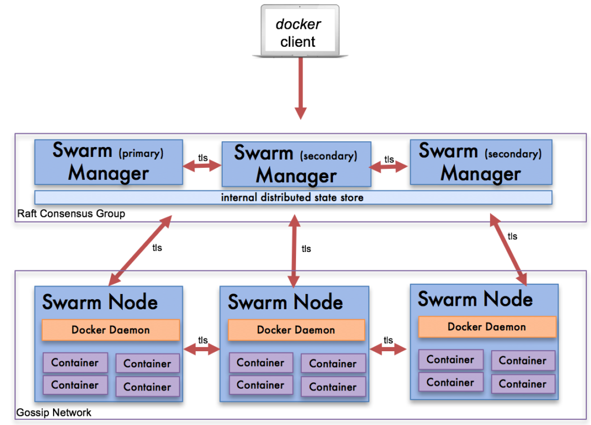
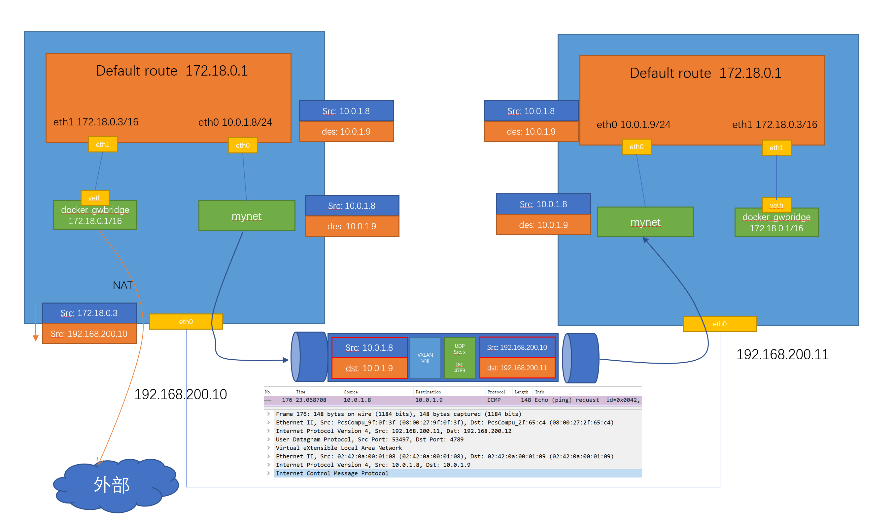
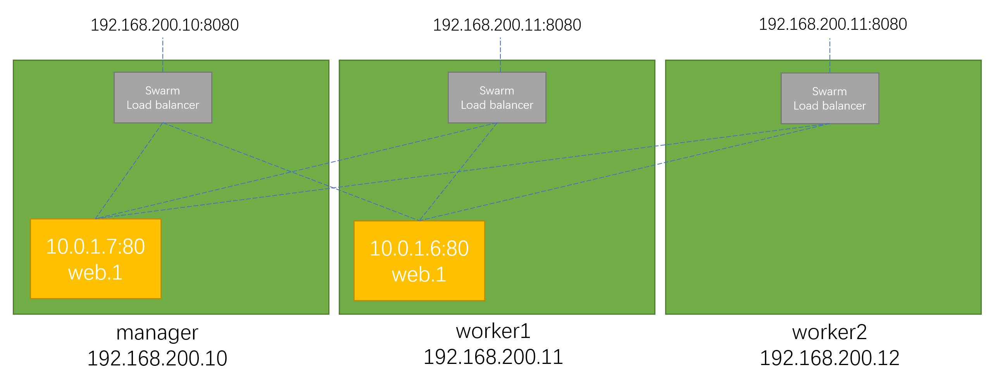

# Docker 学习笔记（八）docker swarm


## 1. docker swarm 简介

### 1.1 不建议生产环境使用 docker-compose

- docker compose 是单机环境，物理机如果挂掉，上面的容器全部会挂掉，无法保证可靠性
- 无法跨机器做横向扩展

### 1.2 容器编排 swarm



- 多个 manager：一个 primary，多个 secondary

## 2. swarm 单节点

- 创建 swarm：`docker swarm init`
- 查看 nodes：`docker node ls`

docker swarm init 背后发生了什么? 

- 主要是PKI和安全相关的自动化
  - 创建swarm集群的根证书
  - manager节点的证书
  - 其它节点加入集群需要的tokens
- 创建Raft数据库用于存储证书，配置，密码等数据

swarm 节点操作：

- service：类似 compose 里 service 的概念， 一个 service 对于多个 replica（多个容器）
- 创建 service：`docker service create [OPTIONS] <IMAGE> [COMMAND]`
- 横向扩展 service：`docker service update <SERVICE> --replicas <NUM>`、`docker service scale SERVICE=REPLICAS [SERVICE=REPLICAS...]`
- 一个 replica 挂掉后，service 会自动新建一个
- 删除 service：`docker service rm <SERVICE>`
- 查看 service:
  - 查看 service：`docker service ls`
  - 查看 tasks(各个 replica 包括其在哪个节点上)：`docker service ps <SERVICE> [SERVICE...]`


## 3. swarm 三节点搭建

- service 相关操作要在 manager 上

## 4. swarm 的 overlay 网络

- 创建 overlay 网络：`docker network create -d overlay <NAME>`
- 创建 service 指定 overlay 网络：`docker service create --network <overlay-network-name> <IMAGE> [COMMAND]`
- 外部如何访问部署运行在swarm集群内的服务，可以称之为`入方向`流量，在swarm里我们通过 `ingress` 来解决
- 部署在swarm集群里的服务，如何对外进行访问，这部分又分为两块:
  - 第一，`东西向流量` ，也就是不同swarm节点上的容器之间如何通信，swarm通过 `overlay` 网络来解决；
  - 第二，`南北向流量` ，也就是swarm集群里的容器如何对外访问，比如互联网，这个是 `Linux bridge + iptables NAT` 来解决的



在容器里执行 `ip addr` 可以看到设备 ip：

```bash
1: lo: <LOOPBACK,UP,LOWER_UP> mtu 65536 qdisc noqueue qlen 1000
    link/loopback 00:00:00:00:00:00 brd 00:00:00:00:00:00
    inet 127.0.0.1/8 scope host lo
       valid_lft forever preferred_lft forever
21: eth0@if22: <BROADCAST,MULTICAST,UP,LOWER_UP,M-DOWN> mtu 1450 qdisc noqueue 
    link/ether 02:42:0a:00:01:03 brd ff:ff:ff:ff:ff:ff
    inet 10.0.1.3/24 brd 10.0.1.255 scope global eth0
       valid_lft forever preferred_lft forever
23: eth1@if24: <BROADCAST,MULTICAST,UP,LOWER_UP,M-DOWN> mtu 1500 qdisc noqueue 
    link/ether 02:42:ac:12:00:03 brd ff:ff:ff:ff:ff:ff
    inet 172.18.0.3/16 brd 172.18.255.255 scope global eth1
       valid_lft forever preferred_lft forever
```


在容器里执行 `ip route` 可以看到路由：

```bash
default via 172.18.0.1 dev eth1 
10.0.1.0/24 dev eth0 scope link  src 10.0.1.3 
172.18.0.0/16 dev eth1 scope link  src 172.18.0.3 
```

可以看出：
- 默认走 eth1(bridge 网络)
- 10.0.1.0/24 的流量会走 eth0(overlay 网络)

## 5.swarm 的 ingress 网络

- docker swarm 的`ingress`网络又叫 `Ingress Routing Mesh`，主要是为了实现把service的服务端口对外发布出去，让其能够被外部网络访问到。
- ingress routing mesh是docker swarm网络里最复杂的一部分内容，包括多方面的内容：
  - iptables的 Destination NAT流量转发
  - Linux bridge, network namespace
  - 使用IPVS技术做负载均衡
  - 包括容器间的通信（overlay）和入方向流量的端口转发



- 任意节点上都可以访问的映射的网络端口
- 负载均衡

## 6. 内部负载均衡和 VIP

- 在一个 overlay 网络中，访问 service 名称，DNS 会解析到 overlay 网络的 VIP(virtual ip)，由 VIP 做负载均衡

## 7. swarm stack 部署多 service 应用

1. 编写 `docker-compose.yml` 文件
2. build image `docker-compose build`
3. 通过 docker stack 部署：`docker stack deploy --compose-file docker-compose.yml <Stack-Name>`

## 8. 在 swarm 中使用 secret

使用 docker secret 保护敏感信息

- 通过 std 创建 secret：`echo abc123 | docker secret create mysql_pass -`
- 从文件创建 secret：`docker secret create mysql_pass mysql_pass.txt`
- 使用 secret：
  - 创建 service 时指定 secret：`--secret mysql_pass`
  - 该 secret 会挂载到容器的文件系统中：`/run/secrets/mysql_pass`

## 9. swarm 使用 local volume

- `docker service create --mount`
- 在 docker-file 中配置 volume，通过 `docker stack deploy` 部署


---

> 作者: [黄波](https://boh5.github.io)  
> URL: https://boh5.github.io/posts/notes/devops/docker/imooc/8-docker-swarm/  

