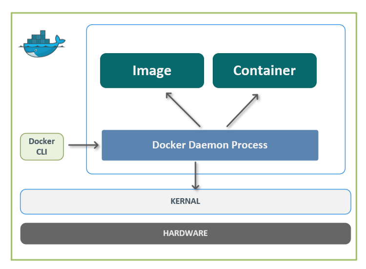
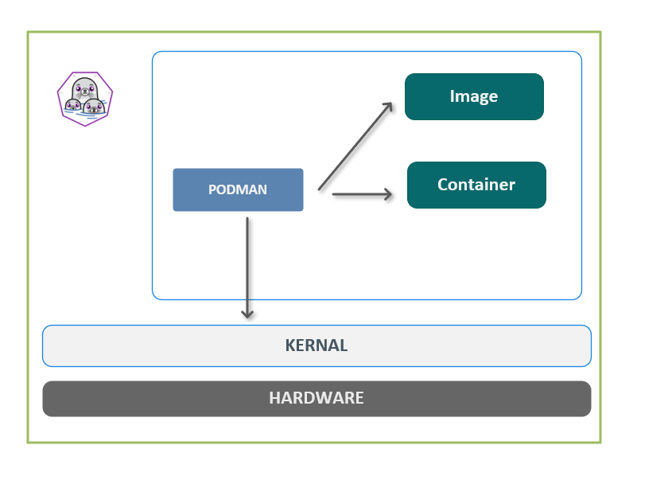

# Docker 学习笔记（九）docker vs podman

## 1. podman 简介

### 1.1 什么是 podman

- `Podman` 是一个基于 `Linux` 系统的 `daemon-less` 的容器引擎。 可以用来开发，管理和运行 `OCI` 标准的容器. podman 可以运行在 root 或者非 root 用户模式。
- `podman` 与 `docker` 命令完全兼容，只需将 `docker` 替换为 `podman` 即可

### 1.2 podman 和 docker 的区别

- 最主要的区别是podman是**Daemonless**的，而Docker在执行任务的时候，必须依赖于后台的docker daemon
- podman不需要使用root用户或者root权限，所以**更安全**。
- podman可以创建**pod**，pod的概念和Kubernetes 里定义的pod类似
- podman运行把镜像和容器存储在**不同的地方**，但是docker必须存储在docker engineer所在的本地
- podman是传统的 **fork-exec** 模式，而docker是 client-server 架构

docker 架构：

podman 架构

---

> 作者: [黄波](https://dilless.github.io)  
> URL: https://dilless.github.io/posts/notes/devops/docker/imooc/9-docker-vs-podman/  

