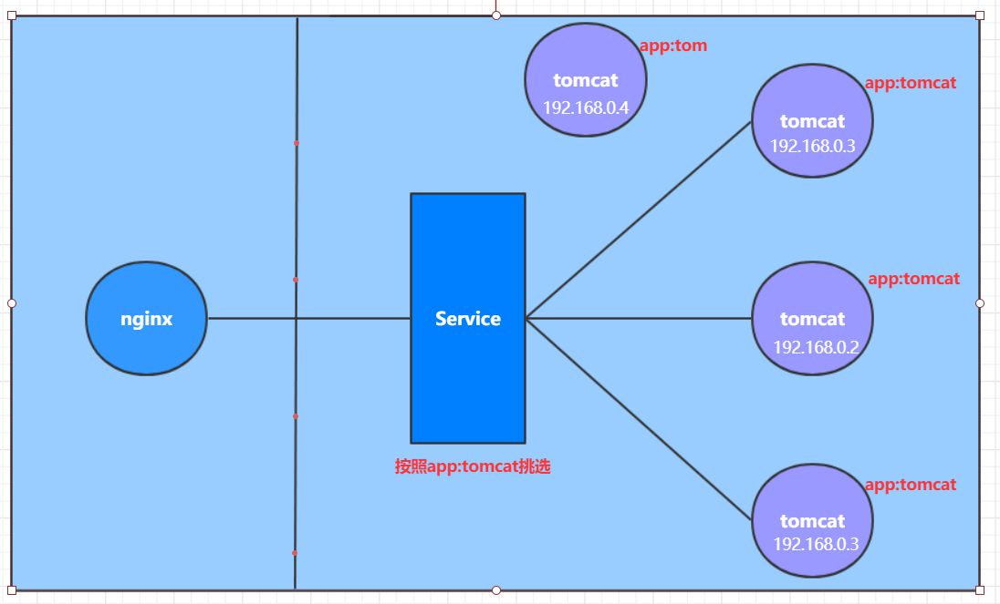

# K8s 学习笔记（一）基础


## 1. Kubernetes 介绍

### 1.1 应用部署方式的演变

> 直接部署在物理机 -> 虚拟化部署 -> 容器化部署

容器化部署方式给带来很多的便利，但是也会出现一些问题，比如说：

- 一个容器故障停机了，怎么样让另外一个容器立刻启动去替补停机的容器
- 当并发访问量变大的时候，怎么样做到横向扩展容器数量

这些容器管理的问题统称为**容器编排**问题，为了解决这些容器编排问题，就产生了一些容器编排的软件：

- **Swarm**：Docker自己的容器编排工具
- **Mesos**：Apache的一个资源统一管控的工具，需要和Marathon结合使用
- **Kubernetes**：Google开源的的容器编排工具

### 1.2 Kubernetes 简介

kubernetes的本质是**一组服务器集群**，它可以在集群的每个节点上运行特定的程序，来对节点中的容器进行管理。目的是实现资源管理的自动化，主要提供了如下的主要功能：

- **自我修复**：一旦某一个容器崩溃，能够在1秒中左右迅速启动新的容器
- **弹性伸缩**：可以根据需要，自动对集群中正在运行的容器数量进行调整
- **服务发现**：服务可以通过自动发现的形式找到它所依赖的服务
- **负载均衡**：如果一个服务起动了多个容器，能够自动实现请求的负载均衡
- **版本回退**：如果发现新发布的程序版本有问题，可以立即回退到原来的版本
- **存储编排**：可以根据容器自身的需求自动创建存储卷

### 1.3 Kubernetes 组件


- **Master**，集群的控制平面，负责集群管理：
  - ApiServer：资源操作的唯一入口，接收用户输入的命令，提供认证、授权、API注册和发现等机制
  - Scheduler：集群资源调度，按照预定的调度策略将Pod调度到相应的node节点上
  - ControllerManager：维护集群的状态，比如程序部署安排、故障检测、自动扩展、滚动更新等
  - Etcd：存储集群中各种资源对象的信息
- **Node**，集群的数据平面，负责为容器提供运行环境：
  - Kubelet：维护容器的生命周期，即创建、更新、销毁容器
  - KubeProxy：集群内部的服务发现和负载均衡
  - Docker、Containerd：各种容器操作

**举例**，部署一个 nginx 服务：
1. 首先要明确，一旦kubernetes环境启动之后，master和node都会将自身的信息存储到etcd数据库中
2. 一个nginx服务的安装请求会首先被发送到master节点的apiServer组件
3. apiServer组件会调用scheduler组件来决定到底应该把这个服务安装到哪个node节点上在此时，它会从etcd中读取各个node节点的信息，然后按照一定的算法进行选择，并将结果告知apiServer
4. apiServer调用controller-manager去调度Node节点安装nginx服务
5. kubelet接收到指令后，会通知docker，然后由docker来启动一个nginx的pod。pod是kubernetes的最小操作单元，容器必须跑在pod中至此
6. 一个nginx服务就运行了，如果需要访问nginx，就需要通过kube-proxy来对pod产生访问的代理这样，外界用户就可以访问集群中的nginx服务了

### 1.4 Kubernetes 概念



- Master：集群控制节点，每个集群至少一个
- Node：集群工作节点
- Pod：K8s 最小控制单元，容器运行在 pod 中，一个 pod 可以运行多个容器
- Controller： 控制器，实现对 pod 的管理，比如启动 pod、停止 pod、伸缩 pod
- Service：pod 对外服务的统一入口，下面维护着同一类的多个 pod
- Label：标签，对 pod 分类
- NameSpace：命名空间，隔离 pod 的运行环境

## 2. 集群环境搭建

### 2.1 环境规划

#### 2.1.1 集群类型

kubernetes集群大体上分为两类：**一主多从**和**多主多从**。

- 一主多从：一台Master节点和多台Node节点，搭建简单，但是有单机故障风险，适合用于测试环境
- 多主多从：多台Master节点和多台Node节点，搭建麻烦，安全性高，适合用于生产环境

#### 2.1.2 安装方式

kubernetes有多种部署方式，目前主流的方式有kubeadm、minikube、二进制包

- minikube：一个用于快速搭建单节点kubernetes的工具
- kubeadm：一个用于快速搭建kubernetes集群的工具
- 二进制包 ：从官网下载每个组件的二进制包，依次去安装，此方式对于理解kubernetes组件更加有效

#### 2.1.3 主机规划

- 本教程搭建 `1 主 2` 从集群
- kube* version：`1.23.10`(1.24.x 移除了 dockershim， 跑不起来，通过 cri-dockerd 也不行，就用老版本了)
- docker version：`20.10.17`

### 2.2 安装步骤

- 初始化环境
  - 主机名解析(/etc/hosts)
  - 时间同步(chronyd)
  - 禁用 iptables, firewall, selinux, swap
  - 网桥过滤和地址转发
- 安装 docker, kubeadm, kubectl, kubelet
- 安装、配置 ipvs
- init master, 添加 node
- 安装网络插件 flannel

## 3. 资源管理

### 3.1 资源管理介绍

在kubernetes中，所有的内容都抽象为资源，用户需要通过操作资源来管理kubernetes。


- kubernetes的本质上就是一个集群系统，用户可以在集群中部署各种服务，所谓的部署服务，其实就是在kubernetes集群中运行一个个的容器，并将指定的程序跑在容器中。
- kubernetes的最小管理单元是pod而不是容器，所以只能将容器放在`Pod`中，而kubernetes一般也不会直接管理Pod，而是通过`Pod控制器`来管理Pod的。
- Pod可以提供服务之后，就要考虑如何访问Pod中服务，kubernetes提供了`Service`资源实现这个功能。
- 如果Pod中程序的数据需要持久化，kubernetes还提供了各种`存储`系统。

> 学习kubernetes的核心，就是学习如何对集群上的`Pod、Pod控制器、Service、存储`等各种资源进行操作

### 3.2 YAML 语言

[YAML 语言教程 - 阮一峰的网络日志](https://www.ruanyifeng.com/blog/2016/07/yaml.html)

### 3.3 资源管理方式

- 命令式对象管理：直接使用命令去操作kubernetes资源

  `kubectl run nginx-pod --image=nginx:1.17.1 --port=80`

- 命令式对象配置：通过命令配置和配置文件去操作kubernetes资源

  `kubectl create/patch -f nginx-pod.yaml`

- 声明式对象配置：通过apply命令和配置文件去操作kubernetes资源

  `kubectl apply -f nginx-pod.yaml`

| 类型           | 操作对象 | 适用环境 | 优点           | 缺点                             |
| -------------- | -------- | -------- | -------------- | -------------------------------- |
| 命令式对象管理 | 对象     | 测试     | 简单           | 只能操作活动对象，无法审计、跟踪 |
| 命令式对象配置 | 文件     | 开发     | 可以审计、跟踪 | 项目大时，配置文件多，操作麻烦   |
| 声明式对象配置 | 目录     | 开发     | 支持目录操作   | 意外情况下难以调试               |

> kubectl可以在node节点上运行吗?

kubectl的运行是需要进行配置的，它的配置文件是\$HOME/.kube，如果想要在node节点运行此命令，需要将master上的.kube文件复制到node节点上

> 三种方式应该怎么用?

- 创建/更新资源：使用声明式对象配置 kubectl apply -f  XXX.yaml
- 删除资源：使用命令式对象配置 kubectl delete -f  XXX.yaml
- 查询资源：使用命令式对象管理 kubectl get(describe) 资源名称

### 3.3.1 命令式对象管理

```bash
kubectl [command] [type] [name] [flags]
```

- **comand**：指定要对资源执行的操作，例如create、get、delete
- **type**：指定资源类型，比如deployment、pod、service
- **name**：指定资源的名称，名称大小写敏感
- **flags**：指定额外的可选参数

**command**：
<table>
	<tr>
	    <th>命令分类</th>
	    <th>命令</th>
		<th>翻译</th>
		<th>命令作用</th>
	</tr>
	<tr>
	    <td rowspan="6">基本命令</td>
	    <td>create</td>
	    <td>创建</td>
		<td>创建一个资源</td>
	</tr>
	<tr>
		<td>edit</td>
	    <td>编辑</td>
		<td>编辑一个资源</td>
	</tr>
	<tr>
		<td>get</td>
	    <td>获取</td>
	    <td>获取一个资源</td>
	</tr>
   <tr>
		<td>patch</td>
	    <td>更新</td>
	    <td>更新一个资源</td>
	</tr>
	<tr>
	    <td>delete</td>
	    <td>删除</td>
		<td>删除一个资源</td>
	</tr>
	<tr>
	    <td>explain</td>
	    <td>解释</td>
		<td>展示资源文档</td>
	</tr>
	<tr>
	    <td rowspan="10">运行和调试</td>
	    <td>run</td>
	    <td>运行</td>
		<td>在集群中运行一个指定的镜像</td>
	</tr>
	<tr>
	    <td>expose</td>
	    <td>暴露</td>
		<td>暴露资源为Service</td>
	</tr>
	<tr>
	    <td>describe</td>
	    <td>描述</td>
		<td>显示资源内部信息</td>
	</tr>
	<tr>
	    <td>logs</td>
	    <td>日志</td>
		<td>输出容器在 pod 中的日志</td>
	</tr>	
	<tr>
	    <td>attach</td>
	    <td>缠绕</td>
		<td>进入运行中的容器</td>
	</tr>	
	<tr>
	    <td>exec</td>
	    <td>执行</td>
		<td>执行容器中的一个命令</td>
	</tr>	
	<tr>
	    <td>cp</td>
	    <td>复制</td>
		<td>在Pod内外复制文件</td>
	</tr>
		<tr>
		<td>rollout</td>
	    <td>首次展示</td>
		<td>管理资源的发布</td>
	</tr>
	<tr>
		<td>scale</td>
	    <td>规模</td>
		<td>扩(缩)容Pod的数量</td>
	</tr>
	<tr>
		<td>autoscale</td>
	    <td>自动调整</td>
		<td>自动调整Pod的数量</td>
	</tr>
	<tr>
		<td rowspan="2">高级命令</td>
	    <td>apply</td>
	    <td>rc</td>
		<td>通过文件对资源进行配置</td>
	</tr>
	<tr>
	    <td>label</td>
	    <td>标签</td>
		<td>更新资源上的标签</td>
	</tr>
	<tr>
		<td rowspan="2">其他命令</td>
	    <td>cluster-info</td>
	    <td>集群信息</td>
		<td>显示集群信息</td>
	</tr>
	<tr>
	    <td>version</td>
	    <td>版本</td>
		<td>显示当前Server和Client的版本</td>
	</tr>
</table>

**type**

<table>
	<tr>
	    <th>资源分类</th>
	    <th>资源名称</th>
		<th>缩写</th>
		<th>资源作用</th>
	</tr>
	<tr>
	    <td rowspan="2">集群级别资源</td>
        <td>nodes</td>
	    <td>no</td>
		<td>集群组成部分</td>
	</tr>
	<tr>
		<td>namespaces</td>
	    <td>ns</td>
		<td>隔离Pod</td>
	</tr>
	<tr>
		<td>pod资源</td>
	    <td>pods</td>
	    <td>po</td>
		<td>装载容器</td>
	</tr>
	<tr>
		<td rowspan="8">pod资源控制器</td>
	    <td>replicationcontrollers</td>
	    <td>rc</td>
		<td>控制pod资源</td>
	</tr>
	<tr>
	    <td>replicasets</td>
	    <td>rs</td>
		<td>控制pod资源</td>
	</tr>
	<tr>
	    <td>deployments</td>
	    <td>deploy</td>
		<td>控制pod资源</td>
	</tr>
	<tr>
	    <td>daemonsets</td>
	    <td>ds</td>
		<td>控制pod资源</td>
	</tr>
	<tr>
	    <td>jobs</td>
	    <td></td>
		<td>控制pod资源</td>
	</tr>	
	<tr>
	    <td>cronjobs</td>
	    <td>cj</td>
		<td>控制pod资源</td>
	</tr>	
	<tr>
	    <td>horizontalpodautoscalers</td>
	    <td>hpa</td>
		<td>控制pod资源</td>
	</tr>	
	<tr>
	    <td>statefulsets</td>
	    <td>sts</td>
		<td>控制pod资源</td>
	</tr>
	<tr>
		<td rowspan="2">服务发现资源</td>
	    <td>services</td>
	    <td>svc</td>
		<td>统一pod对外接口</td>
	</tr>
    <tr>
	    <td>ingress</td>
	    <td>ing</td>
		<td>统一pod对外接口</td>
	</tr>
	<tr>
		<td rowspan="3">存储资源</td>
	    <td>volumeattachments</td>
	    <td></td>
		<td>存储</td>
	</tr>
	<tr>
	    <td>persistentvolumes</td>
	    <td>pv</td>
		<td>存储</td>
	</tr>
	<tr>
	    <td>persistentvolumeclaims</td>
	    <td>pvc</td>
		<td>存储</td>
	</tr>
	<tr>
		<td rowspan="2">配置资源</td>
	    <td>configmaps</td>
	    <td>cm</td>
		<td>配置</td>
	</tr>
	<tr>
	    <td>secrets</td>
	    <td></td>
		<td>配置</td>
	</tr>
</table>

### 3.3.2 命令式对象配置

使用命令配合配置文件一起来操作kubernetes资源。

命令式对象配置的方式操作资源，可以简单的认为：命令  +  yaml配置文件（里面是命令需要的各种参数）


### 3.3.3 声明式对象配置

声明式对象配置跟命令式对象配置很相似，但是它只有一个命令apply。

其实声明式对象配置就是使用apply描述一个资源最终的状态（在yaml中定义状态）

使用apply操作资源：
- 如果资源不存在，就创建，相当于 kubectl create
- 如果资源已存在，就更新，相当于 kubectl patch


---

> 作者: [黄波](https://dilless.github.io)  
> URL: https://dilless.github.io/posts/notes/devops/k8s/itheima/1-k8s-base/  

