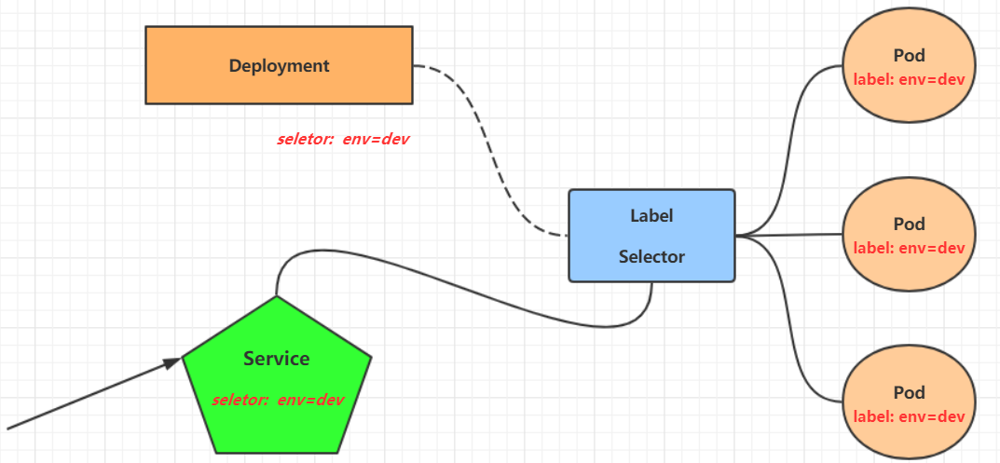

# K8s 学习笔记（二）入门


## 1. Namespace

Namespace是kubernetes系统中的一种非常重要资源，它的主要作用是用来实现**多套环境的资源隔离**或者**多租户的资源隔离**。

- 默认情况下，所有 pod 都可以互相访问
- Namespace 把资源进行逻辑上的分组
- 可以通过 K8s 的授权机制，将不同 namespace 分配给不同租户，实现租户的资源隔离，也可以限定不同租户的资源

Kubernetes 会创建几个默认 namespace

```bash
[root@master ~]# kubectl  get namespace
NAME              STATUS   AGE
default           Active   45h     #  所有未指定Namespace的对象都会被分配在default命名空间
kube-node-lease   Active   45h     #  集群节点之间的心跳维护，v1.13开始引入
kube-public       Active   45h     #  此命名空间下的资源可以被所有人访问（包括未认证用户）
kube-system       Active   45h     #  所有由Kubernetes系统创建的资源都处于这个命名空间
```

**命令**：

```bash
kubectl <command> ns
```

**配置文件**：
```yaml
apiVersion: v1
kind: Namespace
metadata:
  name: dev
```

## 2. Pod

Pod是kubernetes集群进行管理的**最小单元**，程序要运行必须部署在容器中，而容器必须存在于Pod中。

Pod可以认为是容器的封装，一个Pod中可以存在一个或者多个容器。

**命令**：

```bash
kubectl <command> pod
```

**配置文件**：

```yaml
apiVersion: v1
kind: Pod
metadata:
  name: nginx
  namespace: dev
spec:
  containers:
  - image: nginx:1.17.1
    name: pod
    ports:
    - name: nginx-port
      containerPort: 80
      protocol: TCP
```

> kubernetes没有提供单独运行Pod的命令，都是通过Pod控制器来实现的。
> `kubectl run <pod名称> [参数]`

## 3. Label

Label是kubernetes系统中的一个重要概念。它的作用就是在资源上添加标识，用来对它们进行区分和选择。

Label的特点：

- 一个Label会以key/value键值对的形式附加到各种对象上，如Node、Pod、Service等等
- 一个资源对象可以定义任意数量的Label ，同一个Label也可以被添加到任意数量的资源对象上去
- Label通常在资源对象定义时确定，当然也可以在对象创建后动态添加或者删除

可以通过Label实现资源的多维度分组，以便灵活、方便地进行资源分配、调度、配置、部署等管理工作。

> 一些常用的Label 示例如下：
>
> - 版本标签："version":"release", "version":"stable"......
> - 环境标签："environment":"dev"，"environment":"test"，"environment":"pro"
> - 架构标签："tier":"frontend"，"tier":"backend"

标签选择器(Label Selector)：`-l key1=value1,key2=value2`

**命令**：
```bash
# 为资源打标签
kubectl label pod nginx-pod version=1.0 -n dev

# 更新标签
kubectl label pod nginx-pod version=2.0 -n dev --overwrite

# 筛选标签(标签选择器)
kubectl get pod -n dev -l version=2.0  --show-labels

# 删除标签
kubectl label pod nginx-pod version- -n dev
```

**配置文件**：

```yaml
# 创建时 pod 时指定 label
apiVersion: v1
kind: Pod
metadata:
  name: nginx
  namespace: dev
  labels:
    version: "3.0" 
    env: "test"
spec:
  containers:
  - image: nginx:1.17.1
    name: pod
    ports:
    - name: nginx-port
      containerPort: 80
      protocol: TCP
```

## 4. Deployment

在kubernetes中，Pod是最小的控制单元，但是kubernetes很少直接控制Pod，一般都是通过Pod控制器来完成的。

Pod控制器用于pod的管理，确保pod资源符合预期的状态，当pod的资源出现故障时，会尝试进行重启或重建pod。

在kubernetes中Pod控制器的种类有很多，本章节只介绍一种：Deployment。

**命令**：

```bash
# 创建 Deployment
kubectl create deploy nginx --image=nginx --port=80 --replicas=3 --namespace=dev

# 删除 Deployment
kubectl delete deploy nginx -n dev
```

**配置文件**：

```yaml
apiVersion: apps/v1
kind: Deployment
metadata:
  name: nginx
  namespace: dev
spec:
  replicas: 3
  selector:
    matchLabels:
      run: nginx
  template:
    metadata:
      labels:
        run: nginx
    spec:
      containers:
      - image: nginx:1.17.1
        name: nginx
        ports:
        - containerPort: 80
          protocol: TCP
```

## 5. Service

虽然每个Pod都会分配一个单独的Pod IP，然而却存在如下两问题：

- Pod IP 会随着Pod的重建产生变化
- Pod IP 仅仅是集群内可见的虚拟IP，外部无法访问

kubernetes设计了Service来解决这个问题。

Service可以看作是一组同类Pod**对外的访问接口**。借助Service，应用可以方便地实现服务发现和负载均衡。



**命令**:

```bash
# 创建(暴露) Service
kubectl expose deploy nginx --name=svc-nginx1 --type=ClusterIP --port=80 --target-port=80 -n dev

# 查看 Service
kubectl get svc svc-nginx1 -n dev -o wide

# 上面创建的Service的type类型为ClusterIP，这个ip地址只用集群内部可访问
# 如果需要创建外部也可以访问的Service，需要修改type为NodePort
kubectl expose deploy nginx --name=svc-nginx2 --type=NodePort --port=80 --target-port=80 -n dev

# 删除 Service
kubectl delete svc svc-nginx-1 -n dev 
```

**配置文件**：

```yaml
apiVersion: v1
kind: Service
metadata:
  name: svc-nginx
  namespace: dev
spec:
  clusterIP: 10.109.179.231
  ports:
  - port: 80
    protocol: TCP
    targetPort: 80
  selector:
    run: nginx
  type: ClusterIP
```


---

> 作者: [黄波](https://boh5.github.io)  
> URL: https://boh5.github.io/posts/notes/devops/k8s/itheima/2-k8s-getting-start/  

