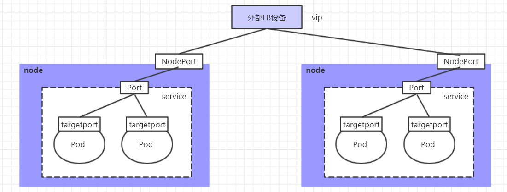

# K8s 学习笔记（五）Service 详解


## 1. Service 介绍

在kubernetes中，pod是应用程序的载体，我们可以通过pod的ip来访问应用程序，但是pod的ip地址不是固定的，这也就意味着不方便直接采用pod的ip对服务进行访问。

为了解决这个问题，kubernetes提供了Service资源，Service会对提供同一个服务的多个pod进行聚合，并且提供一个统一的入口地址。通过访问Service的入口地址就能访问到后面的pod服务。


Service在很多情况下只是一个**概念**，真正起作用的其实是**kube-proxy**服务进程，每个Node节点上都运行着一个kube-proxy服务进程。当创建Service的时候会通过api-server向etcd写入创建的service的信息，而kube-proxy会基于监听的机制发现这种Service的变动，然后**它会将最新的Service信息转换成对应的访问规则**。


### 1.1 kube-proxy 的三种工作模式

#### 1.1.1 userspace模式

userspace模式下，kube-proxy会为每一个Service创建一个监听端口，发向Cluster IP的请求被Iptables规则重定向到kube-proxy监听的端口上，kube-proxy根据LB算法选择一个提供服务的Pod并和其建立链接，以将请求转发到Pod上。


- kube-proxy充当了一个四层负责均衡器的角色
- kube-proxy运行在userspace中，在进行转发处理时会增加内核和用户空间之间的数据拷贝，虽然比较稳定，但是效率比较低。

#### 1.1.2 iptables 模式

iptables模式下，kube-proxy为service后端的每个Pod创建对应的iptables规则，直接将发向Cluster IP的请求重定向到一个Pod IP。


- kube-proxy不承担四层负责均衡器的角色，只负责创建iptables规则
- 较userspace模式效率更高，但不能提供灵活的LB策略，当后端Pod不可用时也无法进行重试

#### 1.1.3 ipvs 模式

pvs模式和iptables类似，kube-proxy监控Pod的变化并创建相应的ipvs规则。


- ipvs相对iptables转发效率更高
- ipvs支持更多的LB算法
- 此模式必须安装ipvs内核模块，否则会降级为iptables

启用 ipvs：

```bash
# 编辑 kube-proxy 的 ConfigMap，设置 data.config_conf.mode = "ipvs"
kubectl edit cm kube-proxy -n kube-system  

# 删除已存在的 kube-proxy，让系统新建
kubectl delete pod -l k8s-app=kube-proxy -n kube-system
```

## 2. Service 类型

**Service 的资源清单**

```yaml
apiVersion: v1  # 资源版本
kind: Service  # 资源类型
metadata: # 元数据
  name: service # 资源名称
  namespace: dev # 命名空间
spec: # 描述
  selector: # 标签选择器，用于确定当前service代理哪些pod
    app: nginx
  type: ClusterIP # Service类型，指定service的访问方式
  clusterIP: '' # 虚拟服务的ip地址，默认随机值
  sessionAffinity: ClientIP # session亲和性，支持ClientIP(同一个客户的的请求打到同一个pod)、None两个选项
  ports: # 端口信息
    - protocol: TCP 
      port: 3017  # service端口
      targetPort: 5003 # pod端口
      nodePort: 31122 # 主机端口
```

Service 类型：

- ClusterIP：**默认值**，它是Kubernetes系统自动分配的虚拟IP，只能在集群**内部访问**
- HeadLiness(ClusterIP 类型，并把 clusterIP 设为 None)：这类Service**不会分配Cluster IP**，如果想要访问service，只能通过service的**域名**进行查询
- NodePort：将Service通过指定的Node上的端口暴露给外部，通过此方法，就可以在集群**外部访问**服务
- LoadBalancer：使用**外接负载均衡器**完成到服务的负载分发，注意此模式需要外部云环境支持
- ExternalName： 把集群**外部的服务引入集群内部**，直接使用

### 2.1 ClusterIP

**ClusterIP Service 资源清单**

```yaml
apiVersion: v1
kind: Service
metadata:
  name: service-clusterip
  namespace: dev
spec:
  selector:
    app: nginx-pod
  clusterIP: 10.97.97.97 # service的ip地址，如果不写，默认会生成一个
  type: ClusterIP
  ports:
  - port: 80  # Service端口       
    targetPort: 80 # pod端口
```

查看 ClusterIP 类型 service 的详细信息

```bash
# 在这里有一个Endpoints列表，里面就是当前service可以负载到的服务入口
$ kubectl describe svc service-clusterip -n dev
Name:              service-clusterip
Namespace:         dev
Labels:            <none>
Annotations:       <none>
Selector:          app=nginx-pod
Type:              ClusterIP
IP:                10.97.97.97
Port:              <unset>  80/TCP
TargetPort:        80/TCP
Endpoints:         10.244.1.39:80,10.244.1.40:80,10.244.2.33:80
Session Affinity:  None
Events:            <none>
```

添加 Service 后可以看到 ipvs 映射规则

```bash
$ sudo ipvsadm -Ln
IP Virtual Server version 1.2.1 (size=4096)
Prot LocalAddress:Port Scheduler Flags
  -> RemoteAddress:Port           Forward Weight ActiveConn InActConn
TCP  172.17.0.1:31070 rr
  -> 10.244.1.48:80               Masq    1      0          0
TCP  192.168.31.101:31070 rr
  -> 10.244.1.48:80               Masq    1      0          0
TCP  10.96.0.1:443 rr
  -> 192.168.31.101:6443          Masq    1      0          0
TCP  10.96.0.10:53 rr
  -> 10.244.0.4:53                Masq    1      0          0
  -> 10.244.0.5:53                Masq    1      0          0
TCP  10.96.0.10:9153 rr
  -> 10.244.0.4:9153              Masq    1      0          0
  -> 10.244.0.5:9153              Masq    1      0          0
TCP  10.97.97.97:80 rr  # 这里就是我们创建的 service 生成的 ipvs 转发规则，rr 表示轮询
  -> 10.244.1.57:80               Masq    1      0          0
  -> 10.244.2.67:80               Masq    1      0          0
  -> 10.244.2.68:80               Masq    1      0          0

```

**Endpoints**

Endpoints是kubernetes中的一个资源对象，存储在etcd中，用来记录一个service对应的所有pod的访问地址，它是根据service配置文件中selector描述产生的。

一个Service由一组Pod组成，这些Pod通过Endpoints暴露出来，**Endpoints是实现实际服务的端点集合**。换句话说，service和pod之间的联系是通过endpoints实现的。


**负载分发策略(sessionAffinity)**

对Service的访问被分发到了后端的Pod上去，目前kubernetes提供了两种负载分发策略：

- None: 如果不定义，默认使用kube-proxy的策略，比如随机、轮询
- ClientIP: 基于客户端地址的会话保持模式，即来自同一个客户端发起的所有请求都会转发到固定的一个Pod上

### 2.2 Headless

在某些场景中，开发人员可能不想使用Service提供的负载均衡功能，而希望自己来控制负载均衡策略，针对这种情况，kubernetes提供了HeadLess Service，这类Service不会分配Cluster IP，如果想要访问service，只能通过service的域名进行查询。

**Headless Service 资源清单**

```yaml
apiVersion: v1
kind: Service
metadata:
  name: service-headless
  namespace: dev
spec:
  selector:
    app: nginx-pod
  clusterIP: None # 将clusterIP设置为None，即可创建headless Service
  type: ClusterIP
  ports:
  - port: 80    
    targetPort: 80
```

### 2.3 NodePort

NodePort的工作原理是**将service的端口映射到Node的一个端口上**，然后就可以通过`NodeIp:NodePort`来访问service了。

**NodePort Service 资源清单**

```yaml
apiVersion: v1
kind: Service
metadata:
  name: service-nodeport
  namespace: dev
spec:
  selector:
    app: nginx-pod
  type: NodePort # service类型
  ports:
  - port: 80
    nodePort: 30002 # 指定绑定的node的端口(默认的取值范围是：30000-32767), 如果不指定，会默认分配
    targetPort: 80
```

### 2.4 LoadBalancer

LoadBalancer和NodePort很相似，目的都是向外部暴露一个端口，区别在于LoadBalancer会在集群的外部再来做一个负载均衡设备，而这个设备需要外部环境支持的，外部服务发送到这个设备上的请求，会被设备负载之后转发到集群中。



### 2.5 ExternalName

引入集群外部的服务，它通过`externalName`属性指定外部一个服务的地址，然后在集群内部访问此service就可以访问到外部的服务了。

**ExternalName Service 资源清单**

```yaml
apiVersion: v1
kind: Service
metadata:
  name: service-externalname
  namespace: dev
spec:
  type: ExternalName # service类型
  externalName: www.baidu.com  #改成ip地址也可以
```

## 3. Ingress

### 3.1 Ingress 介绍

service对集群之外暴露服务的主要方式有两种：NotePort和LoadBalancer，但是这两种方式，都有一定的缺点：

- NodePort方式的缺点是会占用很多集群机器的端口，那么当集群服务变多的时候，这个缺点就愈发明显
- LB方式的缺点是每个service需要一个LB，浪费、麻烦，并且需要kubernetes之外设备的支持

kubernetes提供了Ingress资源对象，Ingress只需要一个NodePort或者一个LB就可以满足暴露多个Service的需求。工作机制大致如下图表示：


Ingress相当于一个7层的负载均衡器，是kubernetes对反向代理的一个抽象，它的工作原理类似于Nginx，可以理解成在**Ingress里建立诸多映射规则，Ingress Controller通过监听这些配置规则并转化成Nginx的反向代理配置 , 然后对外部提供服务**。

- ingress：kubernetes中的一个对象，作用是定义请求如何转发到service的规则
- ingress controller：具体实现反向代理及负载均衡的程序，对ingress定义的规则进行解析，根据配置的规则来实现请求转发，实现方式有很多，比如Nginx, Contour, Haproxy等等

Ingress（以Nginx为例）的工作原理如下：


1. 用户编写Ingress规则，说明哪个域名对应kubernetes集群中的哪个Service
2. Ingress控制器动态感知Ingress服务规则的变化，然后生成一段对应的Nginx反向代理配置
3. Ingress控制器会将生成的Nginx配置写入到一个运行着的Nginx服务中，并动态更新
4. 到此为止，其实真正在工作的就是一个Nginx了，内部配置了用户定义的请求转发规则

### 3.2 Ingress 的使用

> gcr 镜像无法拉取，用 [gcr.io_mirror](https://github.com/anjia0532/gcr.io_mirror) 这个 mirror

**Ingress 资源清单**

```yaml
apiVersion: networking.k8s.io/v1
kind: Ingress
metadata:
  name: ingress-http
  namespace: dev
spec:
  rules:
  - host: nginx.itheima.com
    http:
      paths:
        - pathType: Prefix
          path: /
          backend:
            service:
              name: nginx-service
              port:
                number: 80
  - host: tomcat.itheima.com
    http:
      paths:
        - pathType: Prefix
          path: /
          backend:
            service:
              name: tomcat-service
              port:
                number: 8080
```


---

> 作者: [黄波](https://dilless.github.io)  
> URL: https://dilless.github.io/posts/notes/devops/k8s/itheima/5-k8s-service-advanced/  

