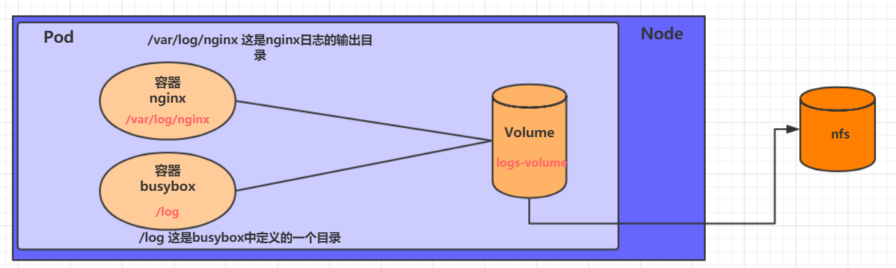

# K8s 学习笔记（六）数据存储


Volume是Pod中能够被多个容器访问的共享目录，它被定义在Pod上，然后被一个Pod里的多个容器挂载到具体的文件目录下，kubernetes通过Volume实现同一个Pod中不同容器之间的数据共享以及数据的持久化存储。Volume的生命容器不与Pod中单个容器的生命周期相关，当容器终止或者重启时，Volume中的数据也不会丢失。

kubernetes的Volume支持多种类型，比较常见的有下面几个：

- 简单存储：EmptyDir、HostPath、NFS
- 高级存储：PV、PVC
- 配置存储：ConfigMap、Secret

## 1. 基本存储

### 1.1 EmptyDir

EmptyDir是最基础的Volume类型，一个EmptyDir就是Host上的一个空目录。

EmptyDir是在Pod被分配到Node时创建的，它的初始内容为空，并且无须指定宿主机上对应的目录文件，因为kubernetes会自动分配一个目录，当Pod**销毁时**， EmptyDir中的数据也会被永久**删除**。

EmptyDir用途：

- **临时空间**，例如用于某些应用程序运行时所需的临时目录，且无须永久保留
- 一个容器需要从另一个容器中获取数据的目录（**多容器共享目录**）

**Pod 资源清单**

```yaml
apiVersion: v1
kind: Pod
metadata:
  name: volume-emptydir
  namespace: dev
spec:
  containers:
  - name: nginx
    image: nginx:1.14-alpine
    ports:
    - containerPort: 80
    volumeMounts:  # 将logs-volume挂在到nginx容器中，对应的目录为 /var/log/nginx
    - name: logs-volume
      mountPath: /var/log/nginx
  - name: busybox
    image: busybox:1.30
    command: ["/bin/sh","-c","tail -f /logs/access.log"] # 初始命令，动态读取指定文件中内容
    volumeMounts:  # 将logs-volume 挂在到busybox容器中，对应的目录为 /logs
    - name: logs-volume
      mountPath: /logs
  volumes: # 声明volume， name为logs-volume，类型为emptyDir
  - name: logs-volume
    emptyDir: {}
```

### 1.2 HostPath

HostPath就是将Node主机中一个实际目录挂在到Pod中，以供容器使用，这样的设计就可以保证Pod销毁了，但是数据依据可以存在于Node主机上。

**Pod 资源清单**

```yaml
apiVersion: v1
kind: Pod
metadata:
  name: volume-hostpath
  namespace: dev
spec:
  containers:
    - name: nginx
      image: nginx:1.17.1
      ports:
        - containerPort: 80
      volumeMounts:
        - name: logs-volume
          mountPath: /var/log/nginx
    - name: busybox
      image: busybox:1.30
      command: ["/bin/sh","-c","tail -f /logs/access.log"]
      volumeMounts:
        - name: logs-volume
          mountPath: /logs
  volumes:
    - name: logs-volume
      hostPath:
        path: /tmp/logs
        type: DirectoryOrCreate  # 目录存在就使用，不存在就先创建后使用
```

`volumes.hostPath.type` 值选项：

- DirectoryOrCreate：目录存在就使用，不存在就先创建后使用
- Directory：目录必须存在
- FileOrCreate： 文件存在就使用，不存在就先创建后使用
- File：文件必须存在
- Socket：unix套接字必须存在
- CharDevice：字符设备必须存在
- BlockDevice：块设备必须存在

### 1.3 NFS

NFS是一个网络文件存储系统，可以搭建一台NFS服务器，然后将Pod中的存储直接连接到NFS系统上，这样的话，无论Pod在节点上怎么转移，只要Node跟NFS的对接没问题，数据就可以成功访问。



**Pod 资源清单**

```yaml
apiVersion: v1
kind: Pod
metadata:
  name: volume-nfs
  namespace: dev
spec:
  containers:
    - name: nginx
      image: nginx:1.17.1
      ports:
        - containerPort: 80
      volumeMounts:
        - name: logs-volume
          mountPath: /var/log/nginx
    - name: busybox
      image: busybox:1.30
      command: ["/bin/sh","-c","tail -f /logs/access.log"]
      volumeMounts:
        - name: logs-volume
          mountPath: /logs
  volumes:
    - name: logs-volume
      nfs:
        server: 192.168.31.101  #nfs服务器地址
        path: /home/dilless/data/nfs #共享文件路径
```

### 1.4 PV 和 PVC

为了能够屏蔽底层存储实现的细节，方便用户使用， kubernetes引入PV和PVC两种资源对象。

- PV（Persistent Volume）：持久化卷的意思，是对底层的共享存储的一种抽象。一般情况下PV由kubernetes管理员进行创建和配置，它与底层具体的共享存储技术有关，并通过插件完成与共享存储的对接。
- PVC（Persistent Volume Claim）：持久卷声明的意思，是用户对于存储需求的一种声明。换句话说，PVC其实就是用户向kubernetes系统发出的一种资源需求申请。


使用了PV和PVC之后，工作可以得到进一步的细分：

- 存储：存储工程师维护
- PV：kubernetes管理员维护
- PVC：kubernetes用户维护

#### 1.4.1 PV (存储资源的抽象)

**PV 资源清单**

```yaml
apiVersion: v1
kind: PersistentVolume
metadata:
  name: pv2
spec:
  nfs: # 存储类型，与底层真正存储对应
    server: ''
    path: ''
  capacity:  # 存储能力
    storage: 2Gi
  accessModes:  # 访问模式
    - 'ReadWriteMany'
  storageClassName: '' # 存储类别
  persistentVolumeReclaimPolicy: 'Retain' # 回收策略
```

**PV 的关键配置参数说明**：

- 存储类型

  底层实际存储的类型，kubernetes支持多种存储类型，每种存储类型的配置都有所差异

- 存储能力（capacity）

  存储空间、IOPS、吞吐量等指标的配置

- 访问模式（accessModes）

  用于描述用户应用对存储资源的访问权限，访问权限包括下面几种方式：

  - ReadWriteOnce（RWO）：读写权限，但是只能被单个节点挂载
  - ReadOnlyMany（ROX）：  只读权限，可以被多个节点挂载
  - ReadWriteMany（RWX）：读写权限，可以被多个节点挂载

  `需要注意的是，底层不同的存储类型可能支持的访问模式不同`

- 回收策略（persistentVolumeReclaimPolicy）

  当PV不再被使用了之后，对其的处理方式。目前支持三种策略：

  - Retain  （保留）  保留数据，需要管理员手工清理数据
  - Recycle（回收）  清除 PV 中的数据，效果相当于执行 rm -rf /thevolume/*
  - Delete  （删除） 与 PV 相连的后端存储完成 volume 的删除操作，当然这常见于云服务商的存储服务

  `需要注意的是，底层不同的存储类型可能支持的回收策略不同`

- 存储类别(storageClassName)

  - 具有特定类别的PV只能与请求了该类别的PVC进行绑定
  - 未设定类别的PV则只能与不请求任何类别的PVC进行绑定


一个 PV 的生命周期中的4个阶段：
  - Available（可用）：     表示可用状态，还未被任何 PVC 绑定
  - Bound（已绑定）：     表示 PV 已经被 PVC 绑定
  - Released（已释放）： 表示 PVC 被删除，但是资源还未被集群重新声明
  - Failed（失败）：         表示该 PV 的自动回收失败

#### 1.4.2 PVC (存储资源的申请)

**PVC 资源清单**

```yaml
apiVersion: v1
kind: PersistentVolumeClaim
metadata:
  name: pvc
  namespace: dev
spec:
  accessModes: # 访问模式
    - ReadWriteMany
  selector: {} # 采用标签对PV选择
  storageClassName: '' # 存储类别
  resources: # 请求空间
    requests:
      storage: 5Gi
```

**Pod 使用 PVC**

```yaml
apiVersion: v1
kind: Pod
metadata:
  name: pod1
  namespace: dev
spec:
  containers:
    - name: busybox
      image: busybox:1.30
      command: [ "/bin/sh","-c","while true;do echo pod1 >> /root/out.txt; sleep 10; done;" ]
      volumeMounts:
        - name: volume
          mountPath: /root/
  volumes:
    - name: volume
      persistentVolumeClaim:  # 使用 PVC
        claimName: pvc1
        readOnly: false
```

### 1.4.3 生命周期


PVC和PV是一一对应的，PV和PVC之间的相互作用遵循以下生命周期：

- **资源供应**：管理员手动创建底层存储和PV

- **资源绑定**：用户创建PVC，kubernetes负责根据PVC的声明去寻找PV，并绑定

  在用户定义好PVC之后，系统将根据PVC对存储资源的请求在已存在的PV中选择一个满足条件的

  - 一旦找到，就将该PV与用户定义的PVC进行绑定，用户的应用就可以使用这个PVC了

  - 如果找不到，PVC则会无限期处于Pending状态，直到等到系统管理员创建了一个符合其要求的PV

  PV一旦绑定到某个PVC上，就会被这个PVC**独占**，不能再与其他PVC进行绑定了

- **资源使用**：用户可在pod中像volume一样使用pvc

  Pod使用Volume的定义，将PVC挂载到容器内的某个路径进行使用。

- **资源释放**：用户删除pvc来释放pv

  当存储资源使用完毕后，用户可以删除PVC，与该PVC绑定的PV将会被标记为“已释放”，但还不能立刻与其他PVC进行绑定。通过之前PVC写入的数据可能还被留在存储设备上，只有在清除之后该PV才能再次使用。

- **资源回收**：kubernetes根据pv设置的回收策略进行资源的回收

  对于PV，管理员可以设定回收策略，用于设置与之绑定的PVC释放资源之后如何处理遗留数据的问题。只有PV的存储空间完成回收，才能供新的PVC绑定和使用

## 2. 配置存储

### 2.1 ConfigMap

ConfigMap是一种比较特殊的存储卷，它的主要作用是用来存储配置信息的。

**ConfigMap 资源清单**

```yaml
apiVersion: v1
kind: ConfigMap
metadata:
  name: configmap
  namespace: dev
data:
  info: |  # | 表示保留换行符
    username:admin
    password:123456
```

**Pod 中挂载 ConfigMap**

```yaml
apiVersion: v1
kind: Pod
metadata:
  name: pod-configmap
  namespace: dev
spec:
  containers:
    - name: nginx
      image: nginx:1.17.1
      volumeMounts: # 将configmap挂载到目录
        - name: config
          mountPath: /configmap/config
  volumes: # 引用configmap
    - name: config
      configMap:
        name: configmap
```

- key--->容器中的文件名
- value---->文件中的内容
- 此时如果更新configmap的内容, 容器中的值也会动态更新

### 2.2 Secret

在kubernetes中，还存在一种和ConfigMap非常类似的对象，称为Secret对象。它主要用于存储敏感信息，例如密码、秘钥、证书等等。


---

> 作者: [黄波](https://boh5.github.io)  
> URL: https://boh5.github.io/posts/notes/devops/k8s/itheima/6-k8s-volume/  

