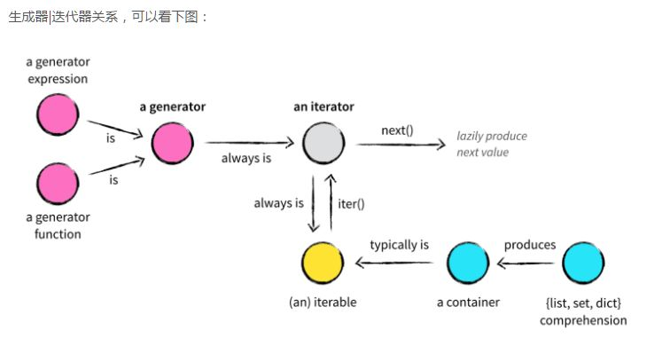

# Python 高级编程（九）迭代器和生成器


## 1. python 中的迭代协议

迭代器是访问集合内元素的一种方式，一般用来遍历数据。迭代器提供了一种惰性访问数据的方式。

- 下标访问依赖：`__getitem__()` 方法
- 可迭代对象(Iterable)：实现 `__iter__()` 方法
- 迭代器(Iterator)：实现 `__iter__()` 和 `__next__()` 方法




```python
from collections.abc import Iterator


class Company:
    """ 可迭代对象 Iterable """
    def __init__(self, employee_list):
        self.employee_list = employee_list

    def __iter__(self):
        """ 返回迭代器 """
        return MyIterator(self.employee_list)


class MyIterator(Iterator):
    """ 迭代器 Iterator """
    def __init__(self, iter_list):
        self.iter_list = iter_list
        self.index = 0

    def __next__(self):
        try:
            val = self.iter_list[self.index]
        except IndexError:
            raise StopIteration
        self.index += 1
        return val
```

## 2. 生成器

- 生成器函数：函数里有 `yield`，就是生成器函数，不再是一个普通函数了
- 生成器对象：生成器函数返回，在 python 编译字节码的时候就产生了
- 生成器为惰性求值（延迟求值）提供了可能


---

> 作者: [黄波](https://boh5.github.io)  
> URL: https://boh5.github.io/posts/notes/languages/python/imooc/9-iterator-generator/  

