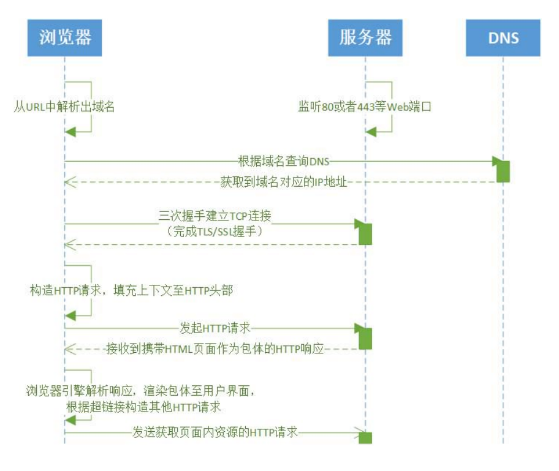
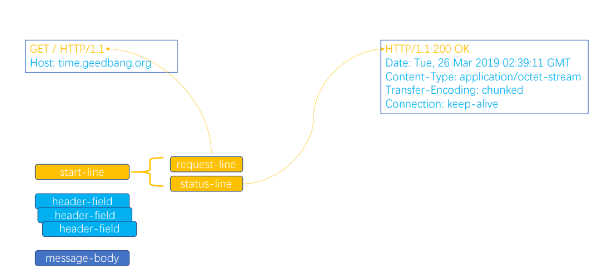
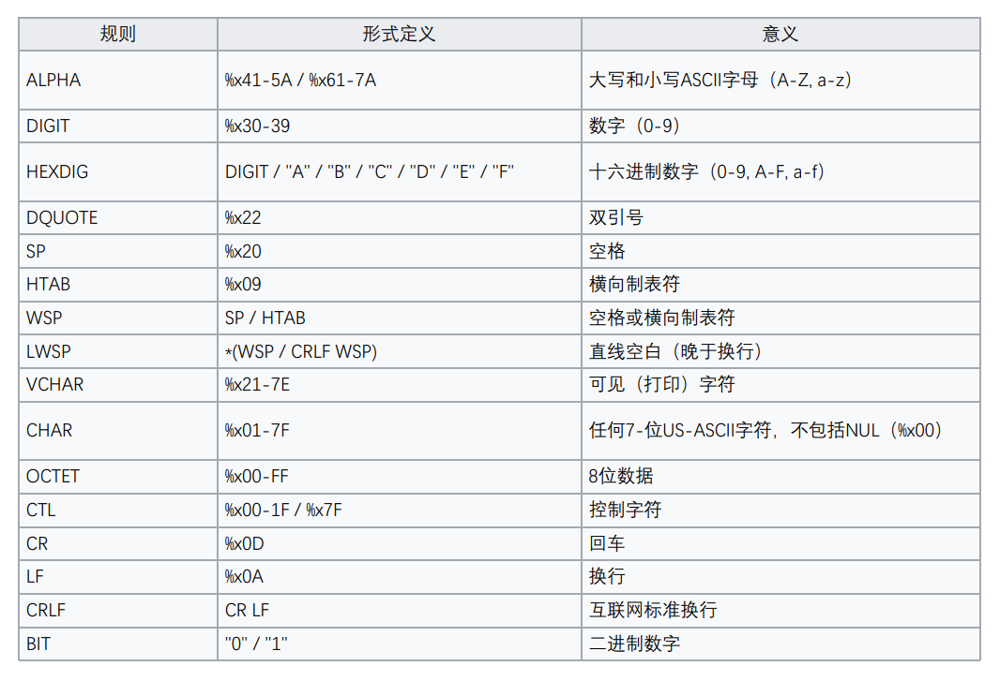
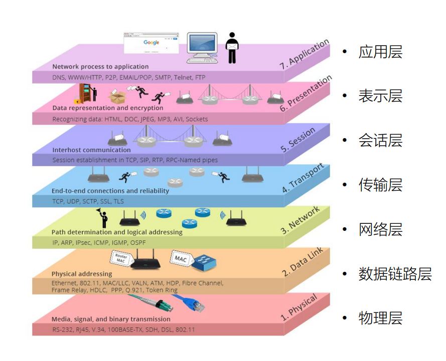
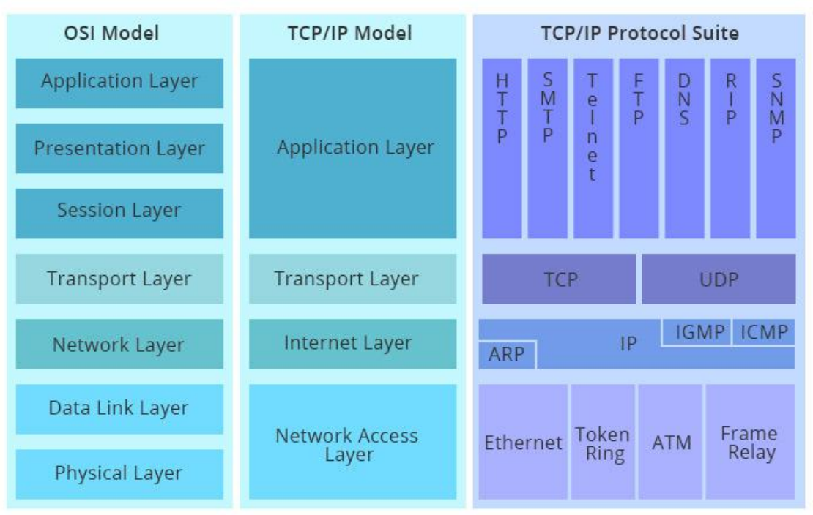

# Web 协议学习笔记(一) HTTP1 协议


## 1. HTTP 协议简介

### 1.1 浏览器发起 HTTP 请求的典型场景



### 1.2 HTTP 协议格式



### 1.3 基于 ABNF 语义定义 HTTP 消息格式

ABNF: 扩充巴克斯-瑙尔范式

#### 1.3.1 ABNF 操作符

- 空白字符：用来分隔定义中的各个元素
- 选择 `/`：表示多个规则都是可供选择的规则
- 值范围 `%c##-##`：
  - `OCTAL = “0” / “1” / “2” / “3” / “4” / “5” / “6” / “7”` 与 `OCTAL = %x30-37` 等价
- 序列组合 `()`：将规则组合起来，视为单个元素
- 不定量重复 `m*n`：
  - 元素表示零个或更多元素： `*( header-field CRLF )`
  - `1*` 元素表示一个或更多元素，`2*4` 元素表示两个至四个元素
- 可选序列 `[]`

#### 1.3.2 ABNF 核心规则



#### 1.3.3 使用 ABNF 描述 HTTP 协议

```abnf
HTTP-message = start-line *( header-field CRLF ) CRLF [ message-body ]
• start-line = request-line / status-line
  • request-line = method SP request-target SP HTTP-version CRLF
  • status-line = HTTP-version SP status-code SP reason-phrase CRLF
• header-field = field-name ":" OWS field-value OWS
  • OWS = *( SP / HTAB ) 
  • field-name = token
  • field-value = *( field-content / obs-fold )
• message-body = *OCTE
```

## 2. OSI 模型和 TCP/IP 模型

### 2.1 OSI 概念模型



> OSI(Open System Interconnection Reference Model)是一个**概念模型**，是理论性的

### 2.2 OSI 模型与 TCP/IP 模型对照



- 分层的**好处**：各层相互独立，如应用层升级很快，下层升级慢没有影响
- 分层的**坏处**：数据延迟，性能下降

**TCP/IP四层模型**
- 应用层：主要有负责web浏览器的HTTP协议， 文件传输的FTP协议，负责电子邮件的SMTP协议，负责域名系统的DNS等。
- 传输层：主要是有可靠传输的TCP协议，特别高效的UDP协议。主要负责传输应用层的数据包。
- 网络层：主要是IP协议。主要负责寻址（找到目标设备的位置）
- 数据链路层：主要是负责转换数字信号和物理二进制信号。


---

> 作者: [黄波](https://dilless.github.io)  
> URL: https://dilless.github.io/posts/notes/networks/web-protocol/geekbang/1-http1-protocol/  

